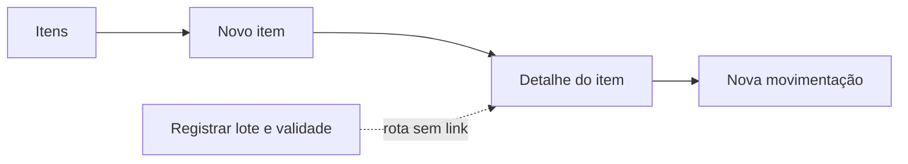
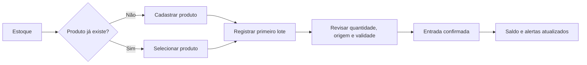
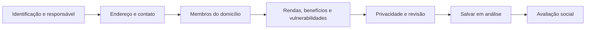

# Projeto Profissional Cesta Digital

> Documento canônico e vivo do produto. Antes de planejar, implementar, homologar ou publicar uma mudança relevante, consultar este arquivo. Documentos datados permanecem como histórico; o estado vigente fica aqui.

## 1. Controle do documento

| Campo | Valor |
|---|---|
| Dono da visão e decisão final | Gabriel Bomfim Bispo |
| Produto | Cesta Digital |
| Última revisão | 15/07/2026 |
| Commit auditado | `374660b8337667137ed2557e4e41d9e4bd4ce5b7` |
| Branch auditada | `main` |
| Ambiente público | Vercel + Render, atualmente configurado como `staging` no backend |
| Decisão vigente | **NO-GO profissional e para ampliar uso com dados e entregas reais** |
| Uso permitido enquanto houver bloqueios | Somente homologação controlada com dados sintéticos ou anonimizados |
| Próxima revisão obrigatória | Após a conclusão da Fase 1 ou qualquer mudança de regra de cadastro social/estoque |

### Regra de atualização

Nenhum item deste documento pode mudar para `Concluído` sem:

1. critério de aceite atendido;
2. teste automatizado proporcional ao risco;
3. evidência de homologação;
4. documentação atualizada;
5. CI verde no mesmo commit publicado.

Status usados no backlog: `Aberto`, `Em andamento`, `Bloqueado`, `Em homologação` e `Concluído`.

## 2. Decisão executiva

O Cesta Digital tem uma fundação técnica valiosa: API organizada por camadas, migrations, RBAC, auditoria, estoque por lote, baixa transacional, frontend React e testes automatizados. O produto está online e os serviços responderam em 14/07/2026.

Entretanto, ele ainda não deve ser classificado como produto profissional homologado. O principal motivo não é visual: lotes vencidos entram no saldo disponível, na disponibilidade de cestas e na seleção automática da entrega. Como a seleção ordena por validade crescente sem excluir vencidos, o lote vencido pode ser consumido primeiro.

Também há um defeito direto de usabilidade: a rota que registra lote e validade existe, mas nenhum link da interface leva até ela. Para o operador, cadastrar um alimento parece encerrar o processo sem solicitar validade.

### Gates e uso permitido

| Marco | Significado | Uso permitido |
|---|---|---|
| Estado atual | `NO-GO` | Somente homologação controlada com dados sintéticos ou anonimizados |
| Checkpoint da Fase 0 | Segurança alimentar imediata, CI, backup e ambiente verificados | Continuar a homologação técnica; não é liberação profissional nem autoriza dados/entregas reais |
| Homologação final da Fase 4 | Todos os casos G0 aprovados, nenhum P0/P1 aberto e decisão final de Gabriel | `GO profissional`; a política de dados aprovada define o escopo real permitido |

Enquanto `BLQ-005` estiver aberto, dado pessoal real é proibido no ambiente público, ainda que exista autorização informal. Depois de sua resolução, o uso real continua bloqueado até o `GO profissional` e a aprovação formal de privacidade/LGPD.

### Leitura por dimensão

| Dimensão | Estado | Decisão |
|---|---|---|
| Fundação backend | Boa | Preservar a separação routes/services/models/schemas |
| Segurança alimentar | Crítica | Corrigir antes de qualquer entrega real |
| Cadastro de estoque | Fragmentado | Unificar a jornada produto → entrada/lote |
| Cadastro social | Rico, porém duplicado e longo | Transformar em prontuário guiado por etapas |
| Mobile | Responsivo tecnicamente, pouco operacional | Substituir tabelas roláveis e páginas longas por padrões próprios |
| Identidade visual | Paleta coerente, linguagem genérica | Redefinir sistema visual sem trocar a marca |
| Testes | Baseline útil, lacunas críticas | Adicionar integração real e casos de validade |
| CI/CD | Não confiável como gate | Impedir publicação de release vermelho |
| LGPD | Diretrizes iniciais, governança incompleta | Formalizar finalidade, acesso, retenção e operação |

## 3. Visão de produto

### Problema real

Organizações comunitárias precisam receber doações, controlar alimentos, avaliar famílias e comprovar entregas sem depender de planilhas isoladas, mensagens, memória individual ou conferências manuais. Quando esses processos não compartilham regras e rastreabilidade, surgem perdas por validade, promessas de cestas sem estoque, cadastros inconsistentes e dificuldade de prestação de contas.

### Visão

Ser a central confiável de abastecimento e cuidado social da organização: cada alimento rastreável, cada família atendida com contexto, cada decisão justificável e cada entrega comprovável.

### Públicos principais

- **Operador de estoque:** recebe itens, registra lotes, controla validade, perdas, saldos e montagem.
- **Liderança social:** cadastra famílias e membros, registra avaliação, benefícios e acompanhamento.
- **Administrador:** gerencia acessos, políticas, auditoria e configuração operacional.
- **Gestor/prestador de contas:** acompanha indicadores, perdas, origem dos recursos e entregas realizadas.
- **Família atendida:** titular dos dados e destinatária do serviço, mesmo sem acessar o sistema nesta fase.

### Proposta de valor

- Evitar que alimento vencido seja considerado utilizável ou entregue.
- Reduzir tempo e erro no recebimento, cadastro social e distribuição.
- Oferecer rastreabilidade do recebimento até a família atendida.
- Apoiar decisões sociais sem substituir a avaliação humana.
- Produzir evidência operacional e financeira compreensível.

### Oportunidade de sustentabilidade financeira

Após validação na UPG, o produto pode atender igrejas, associações e pequenas organizações sociais por:

- implantação e migração assistida;
- assinatura por unidade/volume de operação;
- treinamento e suporte;
- módulos adicionais de prestação de contas e campanhas.

Dados pessoais ou sociais nunca são produto comercial e não podem ser monetizados.

### Não objetivos desta etapa

- Prontuário médico.
- ERP contábil completo.
- Decisão automática definitiva de elegibilidade.
- Coleta ampla de documentos “por garantia”.
- Marketplace ou venda de dados.
- Redesign radical da marca sem aprovação de Gabriel.

## 4. Evidências da auditoria de 14/07/2026

### Validações executadas

- Frontend público `/login`: HTTP 200.
- API pública `/health/db`: `{"database":"ok"}`.
- Frontend local: lint e build aprovados.
- Frontend local: 14/14 testes Playwright aprovados com servidor controlado.
- Backend local: compile aprovado e 29/29 testes aprovados.
- Build atual: JavaScript único de aproximadamente 483 kB, 127 kB gzip.
- Asset de logo usado no app: aproximadamente 1,38 MB.
- Vídeo de splash após login: aproximadamente 2,50 MB.
- CSS global: 4.666 linhas e 116 ocorrências de gradiente.
- Último CI do commit publicado: falha no job frontend, apesar de backend verde. Evidência: [GitHub Actions #29](https://github.com/GabrielB-B/Cesta-Digital/actions/runs/26784908706).

### Pontos positivos a preservar

- Regra de validade localizada no lote, não no produto mestre.
- Baixas com bloqueio pessimista e transação.
- RBAC no frontend e backend.
- Cookie `HttpOnly` para a sessão web.
- Auditoria para várias ações críticas.
- Skip link, foco visível, labels clicáveis e `aria-live` em fluxos importantes.
- Formatação de datas e moedas com helpers/`Intl`.
- Componentes reutilizáveis para cabeçalhos, estados, métricas e formulários.
- Paleta institucional dark com verde, magenta e dourado.

## 5. Bloqueios e achados priorizados

### P0 — bloqueiam operação real

| ID | Achado | Evidência principal | Impacto | Status |
|---|---|---|---|---|
| BLQ-001 | Lote vencido soma no estoque, disponibilidade, dashboard e financeiro; pode ser baixado na entrega | Política central publicada na `main` em `374660b`; CI `main` verde e smoke público `/login` + `/health/db` aprovado em 15/07/2026 | Segurança alimentar e indicadores falsos | Concluído |
| BLQ-002 | Cadastro de lote/validade não é alcançável por nenhum link | Jornada produto → primeiro lote e CTAs de estoque publicados na `main` em `374660b` | Operador não encontra a validade | Concluído |
| BLQ-003 | Commit com CI vermelho foi publicado automaticamente | CI por branch, E2E sem retry, contrato operacional e promoção por fast-forward publicados na `main` em `374660b`; CI `main` verde | Release sem gate de qualidade | Concluído |
| BLQ-004 | Backup/restore não validam integralmente saída, checksum e restauração antes de migration automática | Contrato e drill MySQL local real aprovados em 15/07/2026, incluindo correção do restore por entrada padrão; backup/restore do banco público ainda é obrigatório antes da migration | Rollback do ambiente público ainda não comprovado | Em homologação |
| BLQ-005 | Ambiente público está online, mas documentação e `APP_ENV=staging` não esclarecem se aceita dados reais | Banner e política de homologação aprovados localmente; conteúdo da base ainda precisa ser classificado | Risco operacional e LGPD | Em homologação |

### P1 — alta prioridade

| ID | Achado | Resultado esperado | Status |
|---|---|---|---|
| DOM-001 | Lote sem código, status, quarentena, localização e correção auditada de metadados | Implementado no branch `feat/fase-2-rastreabilidade-entrega-lote`: novas entradas recebem código; status físico governa saldo/saída; localização e correção auditada estão disponíveis; lotes legados são corrigidos gradualmente | Em homologação |
| DOM-002 | `kg`/`litro` aceitos, mas quantidades e receitas são inteiras | Quantidade decimal e apresentação explícita | Aberto |
| DOM-003 | Agregados da família também são digitados nos membros e podem divergir com o tempo | Pessoas e rendas como fonte; agregados derivados | Aberto |
| DOM-004 | Família pode ser marcada apta sem avaliação vinculada | Regra publicada na `main` em `77e7cbe`: cadastro/edição/status manual bloqueiam `apta_recorrente`, `apta_emergencial` e `inapta` sem avaliação social compatível; formulário orienta o caminho correto pela avaliação | Concluído |
| DOM-005 | Agendamento não reserva estoque nem limita ciclo/duplicidade | Publicado na `main` em `88aa60b`: agendamentos ativos passam a respeitar capacidade prometível do estoque utilizável e bloqueiam duplicidade ativa por família+cesta; formulário orienta a regra | Concluído |
| DOM-006 | API de entrega não expõe os itens e lotes efetivamente entregues | Implementado no branch `feat/fase-2-rastreabilidade-entrega-lote`: lista e detalhe expõem item, quantidade, lote, localização e validade; histórico responsivo apresenta a trilha ao operador | Em homologação |
| UX-001 | Navegação plana não representa Social, Estoque, Distribuição e Administração | Arquitetura de informação por tarefa | Aberto |
| UX-002 | Tabelas usam `min-width: 720px`; quase todas dependem de rolagem horizontal no celular | Listas e ações mobile próprias | Aberto |
| UX-003 | Login bloqueia navegação por vídeo não pulável de 7,4–8,5 s, inclusive com movimento reduzido | Entrada imediata aprovada localmente em desktop/mobile e movimento reduzido; publicação pendente | Em homologação |
| UX-004 | Cadastro de família e membro é extenso, sem rascunho, progresso ou proteção de dados não salvos | Wizard retomável com revisão | Em andamento |
| UX-005 | Erros são globais e podem substituir a tela; faltam erros por campo e foco no primeiro erro | Recuperação sem perda de preenchimento | Em andamento |
| UI-001 | Gradientes, faixas laterais e elevação se repetem em superfícies não interativas | Identidade institucional própria e sem ruído | Aberto |
| QA-001 | E2E intercepta toda a API; backend usa SQLite e não executa Alembic/MySQL | Teste integrado da pilha real | Aberto |
| SEC-001 | Cookie cross-site sem defesa CSRF explícita; TLS do banco pode não validar CA | Threat model e hardening | Aberto |
| OPS-001 | Healthcheck do Render aponta para `/`, não para `/health/db` | Blueprint corrigido e testado localmente; configuração efetiva do Render pendente | Em homologação |

### P2/P3 — evolução e dívida

- Schemas de escrita devem rejeitar campos desconhecidos e separar `PATCH` parcial de `PUT` completo.
- Itens/categorias inativos não podem entrar em novos lotes ou receitas.
- Listagem social deve devolver projeção mínima e paginação obrigatória.
- Pessoa precisa de ciclo de vida no domicílio; excluir não deve apagar história necessária.
- Vocabulários de parentesco, escolaridade, moradia, benefício e origem precisam ser controlados.
- Filtros, abas e paginação devem sobreviver no URL e ao comando Voltar.
- Título do documento, `h1`, foco e scroll devem acompanhar cada rota.
- Drawer mobile precisa de `inert`, Escape, contenção de foco, restauração de foco e bloqueio de scroll.
- Rotas devem ser carregadas sob demanda; assets de marca precisam de variantes otimizadas.
- CSS deve ser separado em tokens, base, shell, componentes e módulos.
- Observabilidade precisa de centralização, alertas, retenção e mascaramento de dados.

## 6. Glossário de domínio

| Termo | Definição |
|---|---|
| Produto do catálogo | Definição reutilizável do que é controlado, por exemplo “Arroz 1 kg”. Não possui validade própria. |
| Lote de estoque | Entrada física de um produto, com quantidade, recebimento, validade e rastreabilidade. |
| Saldo físico | Quantidade ainda existente, independentemente de estar disponível. |
| Saldo utilizável | Saldo positivo, liberado e não vencido. É o único que pode compor cesta ou entrega. |
| FEFO | Primeiro a vencer, primeiro a sair, sempre desconsiderando vencidos e bloqueados. |
| Recebimento/doação | Evento que agrupa uma ou mais linhas de produtos recebidos. |
| Família/domicílio | Unidade de atendimento social. |
| Membro | Pessoa vinculada à família em determinado período. |
| Avaliação social | Snapshot dos critérios, dados e decisão em uma data. |
| Receita da cesta | Composição versionada de produtos e quantidades. |
| Reserva | Quantidade comprometida para agendamento/montagem, ainda não entregue. |
| Entrega | Evento concluído com itens, quantidades e lotes efetivamente usados. |

## 7. Jornadas atuais e jornadas-alvo

### 7.1 Estoque e validade

Fluxo atual:



Fluxo-alvo:



Requisitos de UX:

- A ação principal da área deve ser **Registrar entrada no estoque**.
- “Novo produto” é ação secundária do catálogo.
- Ao criar produto com controle de validade, explicar: “A validade muda em cada entrada e será informada no próximo passo”.
- Após criar o produto, oferecer “Registrar primeiro lote” e “Voltar ao catálogo”.
- Listagem e detalhe devem mostrar `Disponível`, `A vencer`, `Vencido`, `Bloqueado` e `Esgotado`.
- O seletor de lote deve mostrar produto, código, saldo, validade e estado.
- Vencidos nunca podem aparecer como opção normal de saída ou entrega.

### 7.2 Família e pessoas

Fluxo atual:


Fluxo-alvo:



Requisitos de UX:

- Criar responsável e família na mesma jornada transacional.
- Permitir salvar rascunho e retomar.
- Derivar totais, faixas etárias, renda e indicadores dos membros/fontes.
- Exibir progresso, pendências e resumo antes de concluir.
- Proteger navegação com alterações não salvas.
- Campos sensíveis aparecem somente quando pertinentes e com explicação de finalidade.
- No celular, a ação principal fica disponível sem exigir retornar ao topo/fim da página.

## 8. Regras de negócio: vigentes e propostas

Status usados nesta seção:

- **Vigente:** regra já adotada pelo produto e que deve ser preservada.
- **Proposta para aprovação:** recomendação da auditoria; não é considerada aprovada apenas por estar neste documento.

Os casos da homologação final usam as propostas como alvo recomendado. Enquanto Gabriel não decidir uma proposta que afete segurança, dados pessoais ou elegibilidade, ela permanece pendente e o `GO profissional` não pode ser concedido.

### 8.1 Estoque

- **RB-EST-001 — Vigente:** validade pertence ao lote; nunca ao produto mestre.
- **RB-EST-002 — Vigente:** produto que controla validade exige data em todo novo lote.
- **RB-EST-003 — Proposta para aprovação:** novo lote com validade anterior ao recebimento é rejeitado; registro legado incoerente é colocado em quarentena durante a migração e nunca entra no saldo utilizável.
- **RB-EST-004 — Proposta para aprovação:** no dia da validade, o lote é considerado válido até o fim da data operacional em `America/Sao_Paulo`.
- **RB-EST-005 — Proposta para aprovação:** saldo utilizável exige saldo positivo, item ativo, lote liberado e validade não vencida.
- **RB-EST-006 — Proposta para aprovação:** resumo, dashboard, disponibilidade de cesta, financeiro e entrega devem usar a mesma política central de saldo.
- **RB-EST-007 — Proposta para aprovação:** consumo automático usa FEFO entre lotes utilizáveis; lote sem validade permitido fica por último.
- **RB-EST-008 — Proposta para aprovação:** janelas de alerta: vence hoje, até 7 dias, até 30 dias e vencido.
- **RB-EST-009 — Proposta para aprovação:** lote vencido não some fisicamente; migra para saldo vencido até baixa por perda/descarte.
- **RB-EST-010 — Proposta para aprovação:** perda/ajuste exige motivo e auditoria; quantidade nunca é editada diretamente.
- **RB-EST-011 — Proposta para aprovação:** origem e apresentação devem usar vocabulários controlados com labels humanas.
- **RB-EST-012 — Proposta para aprovação:** item/categoria inativo não aceita novo lote, receita ou reserva.
- **RB-EST-013 — Proposta para aprovação:** quantidades usam decimal com precisão definida; unidade e apresentação são explícitas.
- **RB-EST-014 — Proposta para aprovação:** operações de baixa precisam ser transacionais e idempotentes.

### 8.2 Social

- **RB-SOC-001 — Proposta para aprovação:** o wizard mantém `rascunho`; ao concluir, o servidor cria/transiciona a família para `em_analise`.
- **RB-SOC-002 — Proposta para aprovação:** uma família concluída deve ter exatamente um responsável ativo.
- **RB-SOC-003 — Proposta para aprovação:** membro possui início, status e eventual saída do domicílio; histórico não é apagado por padrão.
- **RB-SOC-004 — Proposta para aprovação:** totais etários e de moradores são derivados da composição vigente.
- **RB-SOC-005 — Proposta para aprovação:** renda é calculada por fontes vigentes; benefício com datas fora da vigência não entra no total.
- **RB-SOC-006 — Proposta para aprovação:** aprovação referencia uma avaliação social e versão das regras.
- **RB-SOC-007 — Proposta para aprovação:** exceção emergencial exige justificativa e permissão adequada.
- **RB-SOC-008 — Proposta para aprovação:** coaprovador deve estar ativo, possuir papel autorizado e ser diferente do aprovador quando a política exigir.
- **RB-SOC-009 — Proposta para aprovação:** score automático é calculado no servidor; override registra antes/depois e motivo.
- **RB-SOC-010 — Vigente:** CPF, NIS ou outro documento só será coletado após necessidade aprovada e finalidade documentada.

### 8.3 Agendamento e entrega

- **RB-DIS-001 — Proposta para aprovação:** operador consulta somente a projeção mínima de famílias aptas para entrega.
- **RB-DIS-002 — Proposta para aprovação:** política de ciclo define duplicidade, intervalo e limite de cestas.
- **RB-DIS-003 — Proposta para aprovação:** agendamento valida e, quando aprovado, reserva estoque utilizável.
- **RB-DIS-004 — Proposta para aprovação:** confirmação revalida família, receita, reserva, saldo e validade dentro da mesma transação.
- **RB-DIS-005 — Proposta para aprovação:** entrega salva snapshot da receita, itens, quantidades e lotes usados.
- **RB-DIS-006 — Proposta para aprovação:** cancelamento libera reserva e gera auditoria.
- **RB-DIS-007 — Proposta para aprovação:** nenhuma entrega pode ser concluída com lote vencido, bloqueado ou sem saldo.

## 9. Modelo de dados alvo

### 9.1 Produto do catálogo

| Campo | Obrigatoriedade | Observação |
|---|---|---|
| Nome do produto | Obrigatório | Sem marca/apresentação duplicada de forma inconsistente |
| Categoria | Obrigatório | Somente ativa |
| Unidade de estoque | Obrigatório | Ex.: unidade, pacote, kg, litro |
| Quantidade da apresentação | Recomendado | Ex.: `1` |
| Unidade da apresentação | Recomendado | Ex.: `kg` |
| Marca | Opcional | Não deve impedir recebimento |
| Código de barras/SKU | Opcional | Único quando informado |
| Controla validade | Obrigatório | Define exigência no lote |
| Estoque mínimo | Obrigatório | Na unidade de estoque |
| Valor de referência | Opcional | Não substitui valor real do recebimento |
| Ativo | Obrigatório | Default `true` |
| Observações | Opcional | Texto limitado |

### 9.2 Lote físico

| Campo | Obrigatoriedade | Observação |
|---|---|---|
| Código interno | Obrigatório/automático | Ex.: `LOT-000123` |
| Produto | Obrigatório | Produto ativo |
| Lote do fabricante | Opcional | Necessário quando disponível na embalagem |
| Quantidade recebida | Obrigatório | Decimal positivo |
| Quantidade disponível | Derivada | Nunca editada diretamente |
| Data de recebimento | Obrigatório | Data operacional |
| Data de validade | Condicional | Obrigatória quando o produto controla validade |
| Estado operacional | Obrigatório | disponível, quarentena, bloqueado, esgotado, descartado |
| Estado de validade | Derivado | válido, vence_hoje, a_vencer, vencido, sem_validade |
| Origem | Obrigatório | Vocabulário controlado |
| Recebimento/doação | Recomendado | Agrupa várias linhas |
| Localização | Recomendado | Prateleira/depósito |
| Valor unitário estimado | Opcional | Decimal não negativo |
| Motivo de bloqueio | Condicional | Obrigatório para quarentena/bloqueio |
| Observações | Opcional | Texto limitado |

### 9.3 Família e pessoa

Campos pessoais devem seguir minimização. “Ter todos os campos” significa ter os campos necessários, condicionais e bem explicados; não coletar o máximo possível.

| Campo de pessoa | Decisão recomendada |
|---|---|
| Nome completo | Obrigatório |
| Data de nascimento | Obrigatória ou estimada com indicador de precisão |
| Parentesco | Vocabulário controlado + Outro |
| Responsável familiar | Exatamente um responsável ativo por família concluída |
| Status/vigência no domicílio | Obrigatório |
| Telefone/WhatsApp | Opcional, preferencialmente herdado do contato responsável |
| Gênero | Opcional, com “não informar” |
| Escolaridade, trabalho, ocupação | Opcionais/condicionais |
| Renda | Fonte estruturada com vigência, não apenas um número solto |
| Deficiência/doença crônica/gestação/lactação | Dados sensíveis, condicionais e com finalidade visível |
| Vínculo com igreja/UPG | Opcional e com acesso restrito conforme finalidade |
| CPF/NIS/documento | Não coletar nesta fase sem decisão formal de necessidade e base legal |
| Observações | Limitadas, com orientação para não registrar histórico médico ou documentos |

### 9.4 Entidades a introduzir por evolução

- `DonationReceipt` e `DonationLine` para recebimentos com várias linhas.
- `StockLot` enriquecido com código/status/localização.
- `IncomeSource` para renda e benefícios com vigência.
- `BasketRecipeVersion` para não reescrever o passado.
- `StockReservation` ou `BasketAssembly` para compromisso de estoque.
- `DeliveryItem` e `DeliveryLotAllocation` para rastreabilidade da entrega.
- `PrivacyRequest` para solicitações de acesso, correção e anonimização.

## 10. Contrato de API alvo

- `POST /items`: cria produto e retorna `requires_expiration_on_receipt`.
- `POST /stock-lots`: registra lote, valida datas e estado inicial.
- `GET /stock-lots?item_id=&expiry_status=&expires_before=&status=&limit=&offset=`.
- `GET /stock-summary`: retorna `physical`, `usable`, `reserved`, `near_expiry`, `expired` e `quarantined`.
- `GET /stock-alerts/expiration?window_days=30`.
- `PATCH /stock-lots/{id}/metadata`: corrige apenas metadados, com auditoria.
- `POST /stock-movements`: exige motivo em ajuste/perda e chave de idempotência.
- `GET /operational/families?eligible_for_delivery=true`: projeção mínima para operador.
- `POST /families`: cria rascunho/em análise e responsável em transação.
- `PATCH /families/{id}` e `PATCH /people/{id}`: parcial, `extra="forbid"`.
- `POST /social-assessments`: score calculado no servidor e snapshot da regra.
- `POST /delivery-schedules`: valida ciclo e reserva.
- `POST /deliveries/from-schedule/{id}`: idempotente, FEFO apenas em lotes utilizáveis.
- `GET /deliveries/{id}`: expõe itens, quantidades e lotes efetivamente entregues.

## 11. Arquitetura de informação alvo

```text
Visão geral
├── Painel do dia
├── Pendências
└── Alertas

Atendimento social
├── Famílias
├── Avaliações
├── Benefícios
└── Resumo social/financeiro autorizado

Estoque
├── Visão do estoque
├── Registrar entrada
├── Validades
├── Movimentações e perdas
└── Catálogo e categorias

Cestas e distribuição
├── Tipos de cesta
├── Montagem/reservas
├── Agendamentos
└── Entregas

Administração
├── Usuários e permissões
├── Auditoria
└── Configurações
```

Princípios:

- Navegação por tarefa, não por tabela do banco.
- Ação mais frequente visível no primeiro nível.
- Rotas filhas mantêm o módulo correto ativo.
- Linguagem humana: “Doação de alimentos”, não `doacao_item`.
- Implementação não aparece na copy: remover “backend”, “servidor” e detalhes técnicos de telas operacionais.

## 12. UX desktop e mobile

### Desktop

- Densidade operacional moderada, sem transformar todo conteúdo em card.
- Cabeçalho compacto para CRUD; hero amplo apenas quando há decisão importante.
- Tabelas com colunas priorizadas, cabeçalho fixo quando útil e ações previsíveis.
- Filtros persistidos no URL.
- Detalhes com ação principal clara e histórico separado de edição.

### Mobile

- Suporte mínimo de 360 px sem rolagem horizontal da página.
- Listas de famílias, itens, lotes, movimentos e entregas em cards operacionais; tabela apenas quando a comparação exigir.
- Ações principais com área de toque mínima de 44 × 44 px.
- Formulários em uma coluna, por etapas, com ação fixa e respeito a safe areas.
- Drawer fechado com `inert`; Escape, foco preso/restaurado e scroll de fundo bloqueado.
- Teclado adequado: `tel`, `email`, `numeric`, datas e moeda.
- Estados de loading, vazio, erro, sucesso e offline/retry proporcionais ao contexto.

### Métricas de usabilidade

- Operador iniciante encontra “Registrar entrada” sem instrução em até 10 segundos.
- Entrada de lote para produto existente: até 60 segundos, com sucesso ≥ 95%.
- Produto novo + primeiro lote: até 120 segundos, com sucesso ≥ 90%.
- Família + responsável: até 4 minutos; membro adicional: até 90 segundos.
- Nenhuma entrega vencida ou confirmação ambígua em testes.
- Nenhuma perda de preenchimento após erro de API.
- Login libera a aplicação em até 1 segundo depois da autenticação, sem animação obrigatória.

## 13. Direção visual recomendada

### Conceito

**Central de Abastecimento Solidário — editorial operacional humanista.**

A memória visual deve vir de etiquetas de lote, fichas de atendimento, livro-caixa e organização de depósito — não de gradientes, glassmorphism ou faixas decorativas típicas de dashboards genéricos.

### O que permanece

- Base verde-escura institucional.
- Magenta/rosa como assinatura da marca.
- Dourado como foco, atenção e detalhe institucional.
- Símbolo e nome Cesta Digital, com asset otimizado.
- Sensação premium sóbria e acolhedora.

### O que muda

- Superfícies predominantemente sólidas.
- Uma textura contextual muito sutil, não aplicada a cada componente.
- Cor reservada a ação, estado, prioridade e marca.
- Remover faixas laterais coloridas repetitivas de cards/hero.
- Remover hover/elevation de blocos que não são clicáveis.
- Menos cards aninhados; mais seções, linhas, respiro e hierarquia tipográfica.
- Botão primário sólido; gradiente não é padrão de ação.
- Dourado não compete com magenta em todas as superfícies.

### Tipografia recomendada para protótipo

- Títulos editoriais: `Source Serif 4` ou alternativa aprovada.
- Interface e dados: `Atkinson Hyperlegible` ou alternativa humanista aprovada.
- Números: variante tabular.

A troca só deve ocorrer depois de protótipo comparativo e validação de legibilidade. Não instalar fontes antes da aprovação visual.

### Tokens iniciais

| Papel | Referência |
|---|---|
| Fundo | verde-preto profundo atual, sem gradiente dominante |
| Superfície | verde carvão sólido |
| Texto principal | marfim |
| Texto secundário | areia fria |
| Marca/ação | magenta sólido |
| Foco/atenção | dourado |
| Sucesso | verde claro |
| Perigo/validade vencida | vermelho dedicado |
| Raio | 6–10 px, conforme componente |
| Sombra | rara e funcional |

## 14. Acessibilidade

Meta: WCAG 2.2 AA nos fluxos críticos.

- Um `h1` por página e hierarquia correta.
- Título do documento e foco atualizados na navegação.
- `fieldset/legend` para grupos relacionados.
- Erro por campo com `aria-invalid`, `aria-describedby` e foco no primeiro erro.
- Async feedback anunciado sem duplicidade.
- Sem interação dependente apenas de cor, hover ou arraste.
- Movimento reduzido remove vídeo e espera, não apenas acelera animação.
- Tabelas com caption, `scope` e alternativa mobile quando necessário.
- Contraste validado em todos os estados.
- Zoom e reflow preservados.

A auditoria de interface deve seguir as [Web Interface Guidelines](https://github.com/vercel-labs/web-interface-guidelines) e testes manuais de teclado/leitor de tela nos fluxos críticos.

## 15. Segurança e LGPD

### Princípios

- Coletar somente dados necessários e explicar a finalidade.
- Separar visão social completa de projeções operacionais mínimas.
- Restringir saúde, religião, renda e notas por papel e necessidade.
- Não registrar dados sensíveis em logs, métricas ou mensagens de erro.
- Auditoria guarda metadados mínimos e alterações críticas, sem copiar prontuário inteiro.

### Ações obrigatórias

- Classificar formalmente o ambiente público e proibir dados reais enquanto for homologação.
- Definir controlador, operadores, encarregado/responsável e fornecedores.
- Criar aviso de privacidade em linguagem simples e registrar sua versão quando aplicável.
- Criar inventário de dados por campo, finalidade, acesso, retenção e descarte.
- Avaliar e implementar defesa CSRF para cookie `SameSite=None`, incluindo validação de `Origin`.
- Exigir validação da CA do banco em staging/produção; falhar fechado sem configuração válida.
- Adicionar CSP, `frame-ancestors`, `X-Content-Type-Options`, `Referrer-Policy` e `Permissions-Policy`.
- Implementar revisão periódica de acessos e procedimento de titular/incidente.
- Aplicar retenção e anonimização, não apenas documentá-las.

## 16. Estratégia de testes e homologação

### Camadas

1. **Unitários de domínio:** validade, saldo utilizável, FEFO, renda, transições e ciclos.
2. **Integração API:** MySQL compatível, Alembic real, constraints, cookie/CORS/CSRF e concorrência.
3. **Contrato:** OpenAPI ↔ tipos e payloads frontend.
4. **Componentes:** formulários, erros, estados, acessibilidade e responsividade.
5. **E2E mockado:** rápido, para navegação e regressão visual previsível.
6. **E2E integrado:** API e banco reais em ambiente efêmero.
7. **Visual/dispositivos:** Chromium, Firefox e WebKit; 360, 390, 768, 1024, 1440 px.
8. **Usabilidade:** operador e liderança executando tarefas sem orientação do desenvolvedor.

### Casos obrigatórios de validade

- Produto controlado rejeita lote sem validade.
- Validade anterior ao recebimento é rejeitada/quarentenada.
- Lote vencido aparece no físico, mas não no utilizável.
- Dashboard, cesta, financeiro e entrega usam o mesmo saldo utilizável.
- FEFO escolhe o lote válido que vence primeiro.
- Lote que vence hoje segue a regra de data operacional documentada.
- Vencido não pode ser entregue nem selecionado em saída normal.
- Perda por validade zera/reduz saldo e registra motivo/auditoria.
- Concorrência não gera saldo negativo ou dupla baixa.

O roteiro executável fica em [`HOMOLOGACAO_MVP.md`](./HOMOLOGACAO_MVP.md).

## 17. Observabilidade e operação

### Sinais mínimos

- Disponibilidade de frontend, API e banco.
- Taxa/latência de login, cadastro, entrada, agendamento e entrega.
- Erros 4xx/5xx por rota e `request_id`.
- Tentativas bloqueadas por validade.
- Lotes vencidos e a vencer; valor/quantidade em risco.
- Reservas inconsistentes e falhas de baixa.
- Falha de backup, migration, restore e healthcheck.

### Alertas

- Banco indisponível.
- Erro de entrega/estoque acima do limiar.
- Lote vencido com saldo positivo.
- CI/deploy vermelho.
- Backup não verificado dentro da janela.
- Aumento anormal de falhas de login/permissão.

Logs devem ser centralizados, ter retenção definida e mascarar e-mail, IP e dados sociais quando não forem estritamente necessários.

## 18. CI/CD, banco e rollback

### Regra de release alvo

```text
branch de trabalho → pull request → CI verde → revisão/aprovação → merge main
→ backup/migration segura → deploy → smoke produção → evidência → release/tag
```

- `main` deve ser protegida.
- Deploy de produção deve depender do commit aprovado, não apenas de qualquer push.
- Frontend e backend precisam publicar o mesmo identificador de release.
- Healthcheck do Render deve usar `/health/db` ou readiness equivalente.
- Falha pós-deploy aciona rollback da aplicação; rollback de schema nunca é destrutivo por impulso.

### Migration expand/contract para lote e quantidade

1. Verificar backup e restore antes da migration.
2. Adicionar colunas novas compatíveis e inicialmente permissivas.
3. Gerar `internal_lot_code=LOT-{id}` para lotes existentes.
4. Classificar estados por saldo e validade.
5. Colocar em quarentena item controlado sem validade.
6. Migrar quantidades para decimal e reconciliar totais.
7. Publicar código que lê campos antigos e novos quando necessário.
8. Validar contagens e somas em staging.
9. Ativar constraints e índices somente após backfill validado.
10. Remover legado em release posterior.

Índice FEFO recomendado: item, estado, validade e saldo utilizável conforme suporte do banco.

## 19. Plano de execução

### Fase 0 — segurança e confiança de release

Objetivo: eliminar os bloqueios críticos de segurança e release para continuar a homologação técnica controlada. A conclusão desta fase não autoriza dados ou entregas reais e não equivale ao `GO profissional`.

| ID | Entrega | Critério de aceite resumido |
|---|---|---|
| BLQ-001 | Política central de saldo utilizável | Nenhuma consulta ou baixa considera vencido; testes de fronteira verdes |
| BLQ-002 | Jornada visível de entrada/lote | CTA acessível em estoque, produto criado e detalhe; validade explicada |
| BLQ-003 | CI confiável e gate | Mesmo commit verde antes do deploy; flakiness resolvida |
| BLQ-004 | Backup/restore verificável | Exit code, tamanho, checksum e restore testado com evidência |
| BLQ-005 | Classificação de ambiente | Banner/documento e política explícita sobre dados reais |

Arquivos previstos:

- `backend/app/services/stock_batch_service.py`
- `backend/app/services/stock_summary_service.py`
- `backend/app/services/basket_availability_service.py`
- `backend/app/services/dashboard_service.py`
- `backend/app/services/financial_summary_service.py`
- `backend/app/services/delivery_service.py`
- `backend/tests/test_stock_api_integration.py`
- `backend/tests/test_deliveries_api_integration.py`
- `frontend/src/pages/ItemsPage.tsx`
- `frontend/src/pages/ItemCreatePage.tsx`
- `frontend/src/pages/ItemDetailPage.tsx`
- `frontend/src/pages/StockBatchCreatePage.tsx`
- `frontend/src/pages/DashboardPage.tsx`
- `frontend/tests/e2e/app-smoke.spec.ts`
- `.github/workflows/ci.yml`
- `render.yaml`
- `scripts/backup_mysql.ps1`
- `scripts/restore_mysql.ps1`

### Fase 1 — clareza das jornadas

Objetivo: tornar o sistema compreensível sem treinamento técnico.

- Reorganizar navegação por módulos e mapear rotas filhas.
- Renomear ações e enums para linguagem operacional.
- Implementar produto → primeiro lote.
- Criar wizard de família + responsável + membros com rascunho.
- Separar erros de carga e mutação; erros por campo e proteção de formulário.
- Persistir filtros/paginação no URL.
- Remover splash obrigatório do login.

### Fase 2 — domínio e banco profissionais

Objetivo: rastreabilidade e consistência duráveis.

- Enriquecer lote com código, status, localização e bloqueio.
- Migrar quantidades/receitas para decimal.
- Introduzir recebimento com múltiplas linhas.
- Tornar agregados familiares derivados e fontes de renda vigentes.
- Governar transições de elegibilidade e snapshot da regra.
- Versionar receita, reservar estoque e salvar alocação de lotes na entrega.
- Adicionar constraints, índices, idempotência e projeções mínimas.

### Fase 3 — identidade e mobile

Objetivo: consolidar valor percebido e eficiência operacional.

- Prototipar direção visual em login, dashboard, estoque e família.
- Aprovar com Gabriel antes de escalar.
- Implementar tokens e componentes sem gradientes/faixas repetitivas.
- Criar cards/listas mobile para módulos críticos.
- Compactar cabeçalhos CRUD e ações fixas em formulários.
- Otimizar marca, vídeo/assets e lazy loading por rota.
- Dividir CSS monolítico por responsabilidade.

### Fase 4 — hardening e homologação

Objetivo: release demonstravelmente pronto.

- Threat model, CSRF, headers, TLS e matriz completa de permissões.
- Integração com MySQL/Alembic real e testes de concorrência.
- Cross-browser, acessibilidade e dispositivos reais.
- Observabilidade, alertas e runbooks.
- Homologação por perfil e teste de usabilidade.
- Backup/restore/rollback exercitados.
- Tag/release, evidências e decisão final de Gabriel.

## 20. Definition of Done

Uma entrega só está pronta quando:

- regra de negócio e impacto de dados estão documentados;
- migration é aditiva, revisada, testada e possui plano de backfill/rollback;
- backend valida dados e permissões;
- frontend cobre loading, vazio, erro, sucesso e alterações não salvas;
- desktop, 360/390 px e teclado foram validados;
- acessibilidade crítica está aprovada;
- testes unitários, integração e E2E proporcionais passam;
- `git diff --check`, lint, build e testes passam;
- CI do commit está verde;
- não há secrets ou dados pessoais em diff/log/evidência;
- docs, homologação e changelog foram atualizados;
- smoke pós-deploy passou;
- Gabriel aprovou decisões de visão/identidade quando aplicável.

## 21. Decisões recomendadas para aprovação de Gabriel

| Decisão | Recomendação sênior |
|---|---|
| Uso atual do ambiente público | Somente dados sintéticos ou anonimizados até o `GO profissional` e a aprovação formal de privacidade/LGPD |
| Campo de validade | Manter no lote; nunca duplicar no produto |
| Quantidades | Decimal com unidade de estoque + apresentação explícita |
| CPF/NIS | Não coletar por padrão; adicionar somente com necessidade e finalidade aprovadas |
| Cadastro social | Wizard com responsável na primeira etapa e agregados derivados |
| Visual | Aprovar “Central de Abastecimento Solidário” antes da implementação ampla |
| Splash pós-login | Remover bloqueio; feedback opcional de até 600 ms |
| Ordem de trabalho | Fase 0 antes de redesign completo |

Na ausência de decisão diferente, estas recomendações são o padrão de planejamento. Mudanças de banco, identidade visual ou política de dados continuam exigindo aprovação antes da execução.

**Decisão registrada em 14/07/2026:** Gabriel aprovou o plano como padrão de
execução, autorizou a separação por branches/fases, testes proporcionais e
publicação de cada fase somente após os gates verdes. A autorização não altera
o `NO-GO` para dados/entregas reais nem dispensa backup e restore antes de
migrations.

## 22. Registro de evolução

| Data | Evento | Resultado |
|---|---|---|
| 14/07/2026 | Auditoria sênior de produto, domínio, frontend, QA, segurança e produção | Documento canônico criado; decisão `NO-GO`; Fase 0 recomendada |
| 14/07/2026 | Aprovação do plano e início da execução por fases | Branch `feat/fase-0-seguranca-release` aberta; Fase 0 em implementação e revisão independente |
| 14/07/2026 | Checkpoint local da Fase 0 | Backend 53/53; frontend E2E 25/25 sem retry; lint/build/auditorias verdes; frontend e operações aprovados por revisões independentes para o gate remoto |
| 15/07/2026 | Publicação da Fase 0 | Branch `feat/fase-0-seguranca-release` promovida por fast-forward para `main` no commit `374660b8337667137ed2557e4e41d9e4bd4ce5b7`; CI `main` concluído com sucesso; smoke público `/login` HTTP 200 e `/health/db` `{"database":"ok"}` |
| 15/07/2026 | Início da Fase 1 | Branch `feat/fase-1-clareza-jornadas` aberta; primeiro bloco melhora ciclo de rota, título/foco, seção correta, menu por jornadas, filtros em URL, erros inline e proteção contra descarte nos cadastros de família/pessoa |
| 15/07/2026 | Publicação da Fase 1 | Branch `feat/fase-1-clareza-jornadas` promovida para `main` no commit `1afa178`; CI `main` verde; smoke público `/login` HTTP 200 e `/health/db` `{"database":"ok"}` |
| 15/07/2026 | Início da Fase 2 | Branch `feat/fase-2-regras-funcionais` aberta; primeiro bloco governa status social da família por avaliação vinculada e remove ambiguidade do formulário inicial |
| 15/07/2026 | Publicação do checkpoint da Fase 2 | Branch `feat/fase-2-regras-funcionais` promovida para `main` no commit `77e7cbed73e959dc9b5326412d09dcaa0e160cfd`; backend 54/54, frontend lint/build/E2E 25/25, CI `main` verde e smoke público `/login` + `/health/db` aprovado |
| 15/07/2026 | Continuidade da Fase 2 | Branch `feat/fase-2-distribuicao-regras` aberta para tornar agendamento uma promessa confiável, evitando duplicidade ativa e excesso sobre estoque utilizável |
| 15/07/2026 | Publicação do checkpoint de distribuição | Branch `feat/fase-2-distribuicao-regras` promovida para `main` no commit `88aa60bc355c3491ccc88cc1a431b29ba0af4891`; backend 55/55, frontend lint/build/E2E 25/25, CI `main` público `Success` e smoke público `/login` + `/health/db` aprovado |
| 15/07/2026 | Checkpoint local de rastreabilidade da Fase 2 | DOM-001/DOM-006 implementados no branch `feat/fase-2-rastreabilidade-entrega-lote`; backend 56/56, frontend lint/build/E2E 27/27; contrato de backup/restore aprovado; drill MySQL local com restore exato, migration `b7c9d1e2f3a4`, contagens conciliadas e descarte do banco temporário; publicação bloqueada até backup/restore do banco público |
| 15/07/2026 | Gate remoto de rastreabilidade da Fase 2 | Commit `738afe85631095945b84b5fd8be7fcc352ce2078` publicado na branch `feat/fase-2-rastreabilidade-entrega-lote`; workflow `CI` nº `29463482370` aprovado nos jobs `frontend`, `backend` e `operations`; integração em `main` permanece bloqueada até backup/restore do banco público |

Próxima entrada esperada: obter e validar backup/restore do banco público para
publicar o checkpoint de rastreabilidade; depois continuar a Fase 2 em quantidade
decimal e agregados derivados da família.
