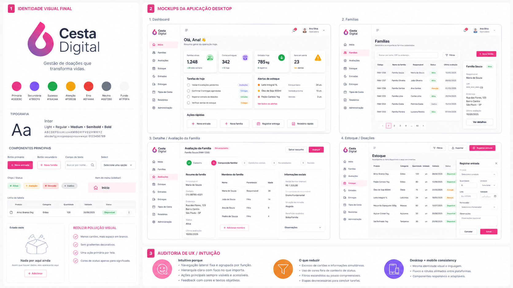

# Plano Mestre de Engenharia - Frontend V2 do Cesta Digital

**Redesign mobile-first e desktop responsivo, preservando contratos funcionais e a marca existente**
**Versão:** 1.1  |  **Data:** 18/08/2026  |  **Status:** direção visual e referências por tela aprovadas para implementação incremental
**Repositório:** [https://github.com/GabrielB-B/Cesta-Digital](https://github.com/GabrielB-B/Cesta-Digital)  |  **Baseline técnico auditado neste plano:** `4e3d24e12a3ab24bba06895052a6f2768e6881c7` (`main`)
**Documento de execução:** destinado a orientar desenvolvimento humano e agentes de engenharia como Codex. Este plano é subordinado às regras de segurança, domínio e publicação do documento canônico do projeto, mas atualiza a decisão de identidade visual do frontend.
> DECISÃO CENTRAL: não reescrever o sistema. Preservar backend, banco, regras de negócio, autenticação, RBAC, URLs, tipos e utilitários. Substituir de forma progressiva a camada de apresentação, o design system e a estrutura interna do frontend, com gates de regressão em cada etapa.

## 1. Objetivo e resultado esperado

O Frontend V2 transforma o Cesta Digital em uma aplicação operacional premium, moderna, clara e predominantemente mobile, sem transformar o redesign em uma reescrita de produto. A nova interface deve parecer um sistema de gestão de doações, alimentos, famílias e entregas - não um dashboard futurista, uma landing page ou uma demonstração de efeitos visuais.
- Preservar o símbolo original da marca Cesta Digital e sua leitura rosa/roxo como elemento proprietário.
- Usar superfícies claras, tipografia forte, espaços generosos e cor apenas quando houver função.
- Projetar primeiro para 360-390 px e então expandir para desktop operacional.
- Reduzir drasticamente cards redundantes, gradientes, faixas decorativas, sombras e duplicação de informação.
- Manter a aplicação rápida, acessível, testável e coerente entre papéis `admin`, `lider_social` e `operador`.
- Permitir migração tela a tela sem interromper o que já funciona em produção/homologação.

## 2. Baseline visual aprovado

A imagem abaixo é a referência visual oficial para a identidade Frontend V2 no momento desta documentação. Ela define linguagem, densidade, proporção, paleta, superfícies e comportamento geral. Os dados e alguns itens de menu nela exibidos são ilustrativos e **não autorizam criar rotas ou métricas inexistentes**.



**Regra de interpretação da referência:** copiar a linguagem visual e os padrões de interação; nunca inventar capacidades, dados, rotas ou permissões apenas para reproduzir um mockup.

### 2.1 Referências específicas por tela

As dez imagens versionadas em [`referencias_por_tela/`](./referencias_por_tela/)
são a referência prioritária da tela correspondente e refinam esta baseline
geral. A autoridade, os hashes, a ordem de aprovação e a exceção controlada de
gradiente estão em
[`MANIFESTO_REFERENCIAS_VISUAIS_POR_TELA.md`](./MANIFESTO_REFERENCIAS_VISUAIS_POR_TELA.md).
A compatibilidade com rotas e APIs reais está registrada em
[`AUDITORIA_FUNCIONAL_REFERENCIAS_POR_TELA_2026-08-18.md`](./AUDITORIA_FUNCIONAL_REFERENCIAS_POR_TELA_2026-08-18.md).

## 3. Fontes técnicas analisadas e compatibilidade

O estado corrente confirma que o redesign pode ser feito sem reescrever a aplicação. O projeto já possui React 19, React Router 7, TypeScript, Axios, Lucide, autenticação por cookie, gates de rota, tipos de domínio, helpers, testes Playwright e backend FastAPI estruturado. O principal passivo de frontend é a camada visual monolítica e a concentração de lógica de UI em páginas grandes.

| Evidência | Estado atual | Implicação para V2 |
| --- | --- | --- |
| `frontend/src/App.tsx` | URLs e RBAC explicitamente definidos | Congelar paths e allowedRoles durante a migração; lazy loading pode ser adicionado sem mudar contrato. |
| `frontend/src/layouts/AppLayout.tsx` | Já contém skip link, drawer mobile, focus trap, Escape, inert, scroll lock e restauração de foco | Preservar esses comportamentos; substituir estrutura visual e extrair componentes menores. |
| `frontend/src/api/client.ts` | Axios central com `withCredentials: true` e timeout comum | Preservar cliente e política de sessão; não criar fetch wrappers paralelos sem decisão arquitetural. |
| `frontend/src/contexts/AuthContext.tsx` | Login/me/logout centralizados e proteção contra respostas obsoletas | Refatorar apresentação sem alterar protocolo de autenticação. |
| `frontend/src/styles/global.css` | ~102 KB; auditoria canônica registra 4.666 linhas e 116 gradientes | Aposentar progressivamente; não tentar limpar por busca/substituição global em um único PR. |
| `frontend/tests/e2e/app-smoke.spec.ts` | ~57 KB de cobertura E2E | Ativo importante; ajustar seletores para semântica estável e ampliar responsividade/visual sem apagar cobertura. |
| `AGENTS.md` na baseline `4e3d24e` | Ordenava preservar “dark premium”, dourado e verde escuro | Conflito removido no marco documental V2-00 antes de qualquer código visual. |
| `docs/PROJETO_PROFISSIONAL_CESTA_DIGITAL.md` | Já recomenda redefinir sistema visual, mobile operacional e CSS modular | A decisão V2 é compatível com o diagnóstico existente e deve ser registrada no documento canônico. |

## 4. Decisões não negociáveis de engenharia

- **Não haverá reescrita do backend** motivada por aparência. Mudança de API só ocorre quando um requisito funcional real exigir.
- **Não haverá troca das URLs públicas** nesta fase. Deep links, Voltar, bookmarks e testes dependem delas.
- **RBAC permanece idêntico** até decisão funcional específica. UI não concede permissão; backend continua sendo autoridade.
- **A marca é preservada.** O símbolo oficial é asset. Gradiente de assinatura é restrito ao asset, ao CTA primário rosa-roxo das referências e ao ambiente institucional sutil do login; superfícies operacionais continuam sem gradiente.
- **Mobile-first é obrigatório.** Nenhuma tela é considerada concluída se só estiver boa em desktop.
- **Uma tela, uma prioridade dominante.** Ação primária precisa ser óbvia; ações secundárias não competem visualmente.
- **Sem perda de dados em formulários.** Erro de API não pode apagar preenchimento; navegação com alterações não salvas deve continuar protegida.
- **Acessibilidade não é pós-processo.** Interação de teclado, foco, rótulos, contraste e reduced-motion fazem parte da implementação.
- **O redesign é estrangulador, não big-bang.** V2 e legado podem coexistir temporariamente, mas cada migração deve reduzir o legado.
- **Nenhuma tela pode mostrar informação inventada para “ficar igual ao mockup”.** O desenho se adapta ao contrato real.

## 5. Identidade visual definitiva - Cesta Digital Clean Humanitarian Operations

### 5.1 Conceito

A nova identidade combina tecnologia operacional com o contexto humano de doação e assistência. O produto deve transmitir confiança, cuidado, organização, rastreabilidade e eficiência. “Premium” significa qualidade de composição e interação - não quantidade de efeitos.
Frase de referência: **gestão de doações que transforma vidas**. A interface operacional, entretanto, evita slogans repetidos; o propósito aparece sobretudo no login, empty states e comunicação institucional.

### 5.2 Paleta canônica

| Token | Hex | Uso permitido | Uso proibido |
| --- | --- | --- | --- |
| Brand logo pink | #EB3385 | Marca, pequenos destaques, gráficos proprietários | Texto branco pequeno em fundo pink; grandes fundos decorativos |
| Brand logo purple | #7C55F4 | Parte do logo, final do CTA primário e ambiente institucional sutil do login | Gradientes em superfícies operacionais, glow, sombras coloridas |
| Primary action | #D92676 | Botão primário e seleção ativa | Todas as bordas, todos os ícones, todos os cards |
| Primary hover | #C2186A | Hover/focus forte do CTA | Superfície de conteúdo |
| Success | #16A34A | Disponível, concluído, ativo quando semanticamente positivo | Decoração de card |
| Warning | #F59E0B | Estoque baixo, pendência, atenção | Status comum sem risco |
| Danger | #EF4444 | Erro, vencido, ação destrutiva | Ênfase genérica |
| Page | #F7F8FA | Fundo da aplicação | Cards e campos |
| Surface | #FFFFFF | Painéis, campos, sidebar/topbar | Grandes áreas com sombra pesada |
| Border | #E5E7EB | Separação e contorno sutil | Contorno grosso decorativo |
| Text | #111827 | Texto principal | Texto sobre fundos de baixo contraste |
| Muted | #6E7583 | Metadados e legendas | Cor de texto principal |

Para texto branco em botão, usar `#D92676` ou tom mais escuro; o rosa do logo `#EB3385` é prioritariamente cor de marca, não necessariamente o único tom de ação. Isso preserva contraste sem descaracterizar a referência.

### 5.3 Tipografia

- Família: **Inter Variable**. É neutra, legível, madura e coerente com o mockup aprovado.
- Display: 28/36, peso 700. Reservado a login ou poucos contextos.
- H1: 24/32, peso 700; no mobile 22/28.
- H2: 20/28, peso 650; H3: 16/24, peso 650.
- Body desktop: 14/20; mobile: 15/22 para leitura confortável.
- Label: 13/18, peso 600; caption: 12/16.
- Não usar caixa alta em grandes blocos. Eyebrows são exceção e devem ser raros.

### 5.4 Espaçamento, raio e sombra

- Escala de espaço: 4, 8, 12, 16, 20, 24, 32, 40, 48 e 64 px.
- Raio: 6 px em controles compactos; 10 px em campos/cards; 14 px em overlays principais; pill apenas para status.
- Sombra padrão de superfície: `0 1px 2px rgba(17,24,39,.04)`; sombra mais visível somente em overlays, menus e drawers.
- Painel não clicável não “levanta” no hover.
- Separação deve preferir espaço, borda ou tipografia antes de card.

### 5.5 Regras anti-poluição

- Zero gradientes em cards, tabelas, navegação, bordas ou sombras. Exceções: asset oficial, CTA primário rosa-roxo e ambiente institucional sutil do login.
- Zero glassmorphism, blur de fundo, glow, partículas, faixas luminosas ou textura visível repetida.
- No máximo uma ação primária por região visual; botões secundários usam contorno/ghost.
- Não aninhar card dentro de card sem necessidade estrutural real.
- Não repetir o mesmo dado em hero, KPI e signal card na mesma tela.
- Ícones não repetem texto sem função; evitar ícone colorido em cada campo/linha.
- Cores semânticas aparecem em badge, ícone de alerta ou borda pequena; nunca tingem a página inteira.
- Hero promocional é removido do dashboard autenticado. Aplicação operacional não é landing page.
- Microcopy de ajuda deve ser curta e contextual; evitar parágrafos explicativos em CRUD simples.
- Tabelas desktop não viram tabela espremida no celular: viram MobileList.

## 6. Arquitetura de informação real - sem criar rotas inexistentes

O mockup desktop mostra conceitos como “Avaliações”, “Entradas” e “Relatórios” em primeiro nível. Hoje nem todos possuem rota própria. Portanto a navegação V2 deve usar somente destinos reais no primeiro corte, agrupando por tarefa.

```text
Início
└── Dashboard (/)

Atendimento social
├── Famílias (/families)
│   ├── Nova família (/families/new)
│   ├── Detalhe / edição
│   ├── Pessoas
│   ├── Benefícios
│   └── Nova avaliação social (rota filha existente)
└── Resumo financeiro (/financial-summary)

Estoque
├── Itens (/items)
│   ├── Novo item
│   ├── Detalhe
│   ├── Registrar entrada (/stock-batches/new)
│   └── Registrar movimentação (/stock-movements/new)
└── Categorias (/item-categories)

Distribuição
├── Tipos de cesta (/basket-types)
└── Entregas (/deliveries)
    └── Novo agendamento (/deliveries/schedules/new)

Administração
├── Usuários (/users)
└── Auditoria (/audit-logs)

```

Se futuramente houver listagem de avaliações, entradas/lotes ou relatórios, as novas rotas podem assumir lugar próprio. Até lá, não criar links falsos ou telas vazias apenas por fidelidade ao mockup.

## 7. Estratégia de navegação responsiva

### 7.1 Desktop >= 900 px

- Sidebar fixa de 232 px; opção de colapso para 72 px pode ser mantida, mas não é requisito de primeira ordem.
- Logo compacto no topo da sidebar. Não duplicar marca na topbar.
- Itens agrupados por módulo; estado ativo com fundo `brand-soft`, ícone/texto escuros e detalhe rosa discreto.
- Topbar de 64 px: breadcrumb/section opcional à esquerda; conta/notificações/contexto à direita.
- Área de conteúdo fluida até 1440 px. Tabelas aproveitam largura; formulários limitados a ~720 px.

### 7.2 Mobile < 900 px

- Topbar de 56 px com símbolo/section, ação contextual e conta quando necessário.
- Bottom navigation com até 4 destinos de alta frequência + “Mais”. O conjunto é filtrado por papel.
- “Mais” abre drawer acessível com destinos restantes e conta/sair.
- Área de toque mínima 44x44 px; labels da bottom nav sempre visíveis.
- Ação de criação pode usar botão sticky ou FAB somente em listas onde criar é o objetivo dominante. Não usar FAB global permanente.
- Conteúdo respeita `env(safe-area-inset-bottom)` e teclado virtual.

## 8. Arquitetura frontend alvo

A organização deve migrar para arquitetura por feature sem obrigar um grande movimento de arquivos no primeiro PR. O objetivo final é separar plataforma, UI compartilhada e domínio visual.

```text
frontend/src/
├── app/
│   ├── AppRouter.tsx
│   ├── AppProviders.tsx
│   └── routeMeta.ts
├── layouts/
│   └── AppShell/
│       ├── AppShell.tsx
│       ├── DesktopSidebar.tsx
│       ├── MobileBottomNav.tsx
│       ├── MoreDrawer.tsx
│       └── AccountMenu.tsx
├── shared/
│   ├── api/
│   │   └── client.ts
│   ├── ui/
│   │   ├── Button/
│   │   ├── Field/
│   │   ├── StatusBadge/
│   │   ├── DataTable/
│   │   ├── MobileList/
│   │   ├── Dialog/
│   │   ├── Drawer/
│   │   └── ...
│   ├── lib/
│   └── styles/
│       ├── tokens.css
│       ├── base.css
│       └── accessibility.css
├── features/
│   ├── auth/
│   ├── dashboard/
│   ├── families/
│   ├── stock/
│   ├── baskets/
│   ├── deliveries/
│   └── administration/
└── legacy/ (temporário; deve encolher a cada fase)

```

**Importante:** não mover simultaneamente todos os arquivos e refazer todas as telas. Primeiro estabilizar design primitives e shell; depois migrar uma feature por vez. Movimentos de diretório devem ser feitos quando os testes permitirem diff compreensível.

## 9. Stack recomendada para o Frontend V2

| Tecnologia | Decisão | Motivo | Estratégia |
| --- | --- | --- | --- |
| React 19 + TypeScript | Manter | Stack atual e adequada | Sem reescrita. |
| React Router 7 | Manter | Rotas/RBAC já funcionam | Adicionar lazy route modules progressivamente. |
| Axios | Manter | Cliente central e contratos existentes | Pode ser usado por query functions. |
| TanStack Query v5 | Adicionar gradualmente | Server state, cache, retry controlado, invalidation e loading padronizado | Começar em uma feature; não converter tudo de uma vez. |
| React Hook Form | Adicionar | Reduz boilerplate e re-render de formulários extensos | Introduzir nos formulários V2. |
| Zod + @hookform/resolvers | Adicionar | Schema de formulário e mensagens consistentes no cliente | Schema deve espelhar, não substituir, validação backend. |
| Lucide React | Manter | Já utilizado; bom conjunto linear | Definir sizes/stroke em AppIcon. |
| Radix UI primitives ou React Aria Components | Usar seletivamente | Acessibilidade em Dialog/Dropdown/Popover/Tabs | Escolher uma família em PR de foundation; não misturar duas bibliotecas. |
| CSS Custom Properties + CSS Modules | Adotar | Identidade proprietária, zero runtime e migração incremental | Tokens globais; estilos locais por componente/feature. |
| Tailwind / UI kit completo | Não adotar como padrão | Aumenta risco de aparência genérica e migração invasiva | Só reconsiderar se houver decisão explícita. |
| Vitest + Testing Library | Adicionar | Cobertura de componentes/formulários sem depender de E2E | Foundation após primitives. |
| Playwright | Manter e ampliar | Fluxos reais, responsividade e visual regression | Viewports fixos + screenshots de telas estáveis. |
| Storybook | Recomendado, não bloqueante | Excelente para Figma/design system/handoff | Pode entrar após 8-12 primitives estáveis. |

## 10. Design system - catálogo obrigatório de componentes

| Componente | Variantes/estados | Contrato V2 |
| --- | --- | --- |
| Button | primary / secondary / ghost / danger / icon | 44px touch min; primary usa brand-action; loading sem mudar largura |
| IconButton | default / subtle / danger | aria-label obrigatório; 44x44 no mobile |
| TextField | default / invalid / disabled / readOnly | label persistente; help/error abaixo; não usar placeholder como label |
| SelectField | native-first ou primitive acessível | mobile-friendly; estado invalid/disabled |
| Checkbox / Radio | default / checked / disabled | área clicável ampla; label associado |
| Textarea | default / invalid | contador somente quando houver limite real |
| SearchField | with clear | debounce somente quando necessário; query sincronizada no URL em listas |
| StatusBadge | success/warning/danger/info/neutral | cor + texto; nunca depender só de cor |
| Alert | info/success/warning/error | para eventos importantes, não para decoração |
| PageHeader | compact / with action | uma ação primária; descrição de uma linha |
| SectionHeader | title / description / action | separa conteúdo sem criar card adicional |
| Surface | panel / inset | uso econômico; sem hover se não clicável |
| DataTable | desktop | cabeçalho fixo opcional; ações previsíveis; coluna principal legível |
| MobileList | mobile | equivalente funcional da tabela; cada item mostra nome, 2-3 metadados e status |
| EmptyState | compact / full | uma mensagem clara e, no máximo, uma ação |
| Skeleton | text/list/card | sem animações intensas; respeitar reduced-motion |
| Modal/Dialog | confirm / form | focus trap, Escape, restore focus, aria |
| Drawer | mobile/desktop side panel | inert background, scroll lock, safe area |
| Tabs | detail views | estado no URL quando relevante; teclado acessível |
| Stepper | form wizard | etapa atual + concluídas; não transformar cada campo em passo |
| ActionBar | form / detail | sticky apenas quando reduz deslocamento; respeitar teclado mobile |
| Pagination | desktop/mobile | preservar busca/filtros no URL |
| BottomNav | mobile | até 4 destinos + Mais; labels sempre visíveis; role-aware |
| Sidebar | desktop | grupos por tarefa; ativo discreto em brand-soft; colapsável opcional |

## 11. Figma - estrutura profissional do arquivo de design

A implementação deve ser precedida ou acompanhada por um arquivo Figma organizado como produto, não por telas soltas. A estrutura abaixo permite que design e Codex falem a mesma linguagem.

```text
00 - Cover & Decisions
01 - Foundations
     Colors / Typography / Spacing / Radius / Shadows / Grid / Motion
02 - Components
     Actions / Forms / Feedback / Navigation / Data display / Overlays
03 - Mobile 390
     Login / Dashboard / Families / Family / Assessment / Stock / Entry / Baskets / Deliveries / More
04 - Desktop 1440
     Same journeys, desktop composition
05 - Tablet 768
06 - States
     Loading / Empty / Error / Offline / Permission / Destructive confirm
07 - Flows
     New family / assessment / receive donation / schedule / confirm delivery
08 - Handoff
     Tokens / component mapping / annotations / edge cases / changelog

```

- Frames primários: 390x844, 360x800, 768x1024, 1280x800 e 1440x900.
- Usar Auto Layout em todos os componentes e seções. Evitar posicionamento absoluto salvo overlay deliberado.
- Nomear componentes conforme código: `Button/Primary`, `StatusBadge/Warning`, `Field/Text/Error`, `Navigation/Bottom/Active`.
- Variantes de estado devem existir no Figma antes de o componente ser considerado estável.
- Tokens de cor/spacing devem usar nomes semânticos, não `pink1`, `gray2`.
- Anotar conteúdo real que vem da API e conteúdo apenas demonstrativo.
- Criar página de changelog visual com data e decisão. A baseline aprovada desta documentação é a primeira entrada.

## 12. Especificações por tela - alvo visual e funcional

### 12.1 Login

- Preservar símbolo e nome Cesta Digital; fundo claro e limpo.
- Desktop: composição simples com área de marca/contexto + formulário; mobile: uma coluna, formulário próximo ao topo útil.
- Campos login/senha com labels persistentes, opção de mostrar senha e erro inline.
- Botão “Entrar” é único CTA primário.
- Remover splash/vídeo obrigatório e qualquer animação que atrase a entrada. Feedback opcional <= 300-600 ms e respeitando reduced-motion.
- Não inventar recuperação de senha se backend não suportar.

### 12.2 Dashboard

- Eliminar hero grande e a duplicação atual entre summaryCards, dashboardSignals e blocos secundários.
- Desktop: no máximo quatro KPIs no topo; abaixo, “Tarefas/Pendências” e “Alertas de estoque”; ações rápidas em uma linha discreta.
- Mobile: saudação curta, 3 prioridades, lista de tarefas do dia e atividade recente. O usuário deve saber onde agir sem interpretar gráficos.
- Usar somente campos de `DashboardOverviewResponse` existentes. Métricas ilustrativas da imagem não viram requisito de API automaticamente.
- Gráficos só entram se responderem a uma pergunta operacional melhor que uma lista/valor.

### 12.3 Famílias - lista

- Desktop: PageHeader compacto, busca + filtros, tabela com código, família/responsável, status, última avaliação e ação.
- Mobile: cards/list items, não tabela horizontal. Exibir nome, código, 1-2 metadados e status; toque abre detalhe.
- Filtro e paginação permanecem no URL para Voltar funcionar.
- “Nova família” é CTA primário e único botão rosa permanente da tela.

### 12.4 Família - detalhe

- Topo: identificação da família, status e uma ação principal contextual.
- Desktop: resumo lateral/coluna + conteúdo principal; mobile: resumo colapsável seguido de tabs/sections.
- Organizar em Resumo, Composição, Avaliações/Benefícios e Histórico conforme dados reais.
- Reduzir cards; preferir seções com divisores e listas.
- Não exibir dados sensíveis além do necessário ao papel e ao fluxo.

### 12.5 Cadastro/edição de família

- Converter formulário longo em wizard lógico, por exemplo: Identificação -> Responsável/contato -> Composição -> Condições sociais -> Renda/benefícios -> Revisão.
- No primeiro corte, preservar o payload atual. Wizard pode manter estado client-side e enviar pelo endpoint existente.
- “Salvar rascunho e retomar” só deve ser prometido quando existir suporte de persistência real; não simular rascunho como recurso concluído.
- ActionBar sticky no mobile com Próximo/Salvar; etapa atual sempre visível.
- Erros por campo, foco no primeiro erro, resumo de erros em etapa quando necessário e proteção de alterações não salvas.

### 12.6 Estoque e doações

- `/items` torna-se a visão operacional do estoque, não uma simples tabela de catálogo.
- Desktop: tabela limpa + filtros; detalhes de alerta por validade/quantidade sem cores excessivas.
- Mobile: item list com nome, apresentação, saldo, validade/alerta principal e status.
- “Registrar entrada” deve ser ação de destaque. A rota existente `/stock-batches/new` permanece o contrato.
- O mockup com drawer lateral pode ser atingido posteriormente usando route overlay; não é pré-requisito se introduzir complexidade/riscos na primeira migração.
- Validade pertence ao lote. UI não desloca esse conceito para produto.

### 12.7 Cestas e entregas

- Tipos de cesta: listagem com nome, quantidade de itens, status e disponibilidade; detalhes sob demanda.
- Entregas: primeira visão por “Hoje/Pendentes/Concluídas”, mantendo filtros/estado de rota.
- Confirmações de entrega mostram claramente família, cesta, horário e consequências antes da ação irreversível.
- Status usam badge + texto; não pintar linhas inteiras.
- Mobile prioriza ação operacional e reduz metadados não essenciais.

### 12.8 Administração e auditoria

- Usuários: tabela desktop, mobile list, filtros simples e papéis explícitos.
- Auditoria é caso legítimo de maior densidade no desktop; no mobile mostrar resumo e detalhe expandível.
- Ações destrutivas ou de permissão exigem confirmação clara.
- Administração nunca deve aparecer para papel sem permissão, mantendo RoleRoute e filtragem de menu.

## 13. Matriz rota por rota

| Rota atual | Arquivo | Acesso | Módulo V2 | Padrão visual/UX | Impacto backend |
| --- | --- | --- | --- | --- | --- |
| /login | LoginPage.tsx | Público | Acesso | Tela limpa de login; marca preservada; sem splash bloqueante | Nenhum |
| / | DashboardPage.tsx | Autenticado | Início | Dashboard operacional por prioridade; sem duplicação de métricas | Nenhum |
| /families | FamiliesPage.tsx | admin, lider_social | Atendimento social | Lista responsiva; tabela desktop + cards mobile | Nenhum |
| /families/new | FamilyCreatePage.tsx | admin, lider_social | Atendimento social | Wizard mobile-first; V2 inicial preserva payload atual | Sem backend no primeiro corte; rascunho real exige evolução posterior |
| /families/:familyId | FamilyDetailPage.tsx | admin, lider_social | Atendimento social | Resumo por abas/seções; ação principal contextual | Nenhum |
| /families/:familyId/edit | FamilyEditPage.tsx | admin, lider_social | Atendimento social | Wizard/sections consistentes com criação | Nenhum no corte visual |
| /families/:familyId/people/new | FamilyPersonCreatePage.tsx | admin, lider_social | Atendimento social | Formulário de membro enxuto e contextual | Nenhum |
| /families/:familyId/people/:personId/edit | FamilyPersonEditPage.tsx | admin, lider_social | Atendimento social | Mesmo padrão de formulário do membro | Nenhum |
| /families/:familyId/benefits/new | FamilyBenefitCreatePage.tsx | admin, lider_social | Atendimento social | Formulário contextual dentro da família | Nenhum |
| /families/:familyId/benefits/:benefitId/edit | FamilyBenefitEditPage.tsx | admin, lider_social | Atendimento social | Edição contextual; preservar histórico | Nenhum |
| /families/:familyId/assessments/new | FamilyAssessmentCreatePage.tsx | admin, lider_social | Atendimento social | Stepper de avaliação social, sem criar rota global inexistente | Nenhum |
| /financial-summary | FinancialSummaryPage.tsx | admin, lider_social | Atendimento social | Resumo financeiro sóbrio; indicadores + tabela/lista | Nenhum |
| /items | ItemsPage.tsx | admin, operador | Estoque | Visão do estoque; filtros compactos; cards mobile | Nenhum |
| /items/new | ItemCreatePage.tsx | admin, operador | Estoque | Cadastro de produto como etapa do recebimento quando aplicável | Nenhum |
| /items/:itemId | ItemDetailPage.tsx | admin, operador | Estoque | Detalhe com saldo, lotes e CTAs; reduzir cards aninhados | Nenhum |
| /item-categories | ItemCategoriesPage.tsx | admin, operador | Estoque | Configuração secundária; densidade moderada | Nenhum |
| /stock-batches/new | StockBatchCreatePage.tsx | admin, operador | Estoque | Registrar entrada; tela/overlay responsivo, URL preservada | Nenhum |
| /stock-movements/new | StockMovementCreatePage.tsx | admin, operador | Estoque | Movimentação/perda com motivo claro e feedback | Nenhum |
| /basket-types | BasketTypesPage.tsx | admin, operador | Distribuição | Tipos de cesta; lista limpa com status | Nenhum |
| /basket-types/new | BasketTypeCreatePage.tsx | admin, operador | Distribuição | Composição da cesta em fluxo objetivo | Nenhum |
| /basket-types/:basketTypeId | BasketTypeDetailPage.tsx | admin, operador | Distribuição | Detalhe/receita; disponibilidade e itens | Nenhum |
| /deliveries | DeliveriesPage.tsx | admin, operador | Distribuição | Hoje/Pendentes/Concluídas; foco operacional | Nenhum |
| /deliveries/schedules/new | DeliveryScheduleCreatePage.tsx | admin, operador | Distribuição | Agendamento curto, validações existentes preservadas | Nenhum |
| /users | UsersPage.tsx | admin | Administração | Gestão de usuários sem excesso de cards | Nenhum |
| /audit-logs | AuditLogsPage.tsx | admin | Administração | Tabela de auditoria densa no desktop; cards resumidos no mobile | Nenhum |

## 14. Matriz de arquivos - preservar, refatorar, remover

| Arquivo/área | Decisão | Diretriz |
| --- | --- | --- |
| frontend/src/App.tsx | Preservar contrato; refatorar depois | Rotas e RBAC atuais são contratos de compatibilidade. Introduzir lazy loading sem alterar paths/roles. |
| frontend/src/api/client.ts | Preservar | Cliente Axios central com withCredentials. Não duplicar clientes HTTP. |
| frontend/src/contexts/AuthContext.tsx | Preservar lógica | Manter /auth/login, /auth/me, /auth/logout e proteção contra respostas obsoletas. Trocar somente apresentação. |
| frontend/src/routes/ProtectedRoute.tsx | Preservar | Gate de autenticação. |
| frontend/src/routes/RoleRoute.tsx | Preservar | Gate de autorização por perfil. |
| frontend/src/routes/routeMeta.ts | Evoluir com cuidado | Manter títulos/sectionPath; revisar copy e adicionar metadata visual sem mudar URL. |
| frontend/src/layouts/AppLayout.tsx | Reescrever marcação/estilo; preservar comportamento crítico | Extrair AppShell, DesktopSidebar, MobileBottomNav, AccountMenu. Reutilizar skip link, focus trap, inert, Escape, restauração de foco e scroll lock. |
| frontend/src/styles/global.css | Aposentar progressivamente | Arquivo de ~102 KB; não reescrever tudo num commit. Criar tokens/base V2, CSS Modules por componente e remover legado por tela. |
| frontend/src/components/BrandLockup.tsx | Refatorar | Preservar símbolo e padronizar lockups; exceções de gradiente pertencem aos componentes CTA/Login, não ao lockup. |
| frontend/src/components/AppIcon.tsx | Preservar/refinar | Manter mapeamento Lucide; padronizar tamanho/stroke e não usar ícone como decoração redundante. |
| frontend/src/components/DataTable.tsx | Substituir por padrão responsivo | Desktop table + MobileList; não depender de min-width e scroll horizontal como solução padrão. |
| frontend/src/components/PageHeader.tsx | Refatorar | CompactPageHeader com título, descrição curta e até uma ação primária. |
| frontend/src/components/MetricCard.tsx | Refatorar fortemente | Reduzir ruído; cartões de KPI somente quando KPI é acionável ou comparável. |
| frontend/src/components/MetricGrid.tsx | Refatorar | Máximo recomendado de quatro KPIs no desktop e três prioridades acima da dobra no mobile. |
| frontend/src/components/FormSection.tsx | Preservar conceito; novo visual | Base para StepSection/FieldGroup. |
| frontend/src/components/FormActions.tsx | Refatorar | ActionBar responsiva; sticky no mobile quando necessário. |
| frontend/src/components/FieldError.tsx | Preservar | Erro inline deve continuar e ser expandido para integração com RHF/Zod. |
| frontend/src/components/StateMessage.tsx | Preservar/refinar | Estados vazio/erro/loading compactos e contextuais. |
| frontend/src/components/PaginationControls.tsx | Preservar/refinar | Manter navegação e URL; adaptar densidade mobile. |
| frontend/src/components/PageLifecycle.tsx | Preservar | Título/foco/scroll por rota é requisito de acessibilidade. |
| frontend/src/components/LoginSuccessOverlay.tsx | Remover após confirmação de ausência de uso | Padrão visual incompatível; não manter vídeo/splash como dependência de navegação. |
| frontend/public/animations/login-splash.mp4 | Remover quando referência chegar a zero | Asset de ~2,5 MB sem valor operacional para V2. |
| frontend/src/assets/logoupg.png | Substituir uso por asset otimizado | ~1,38 MB. Usar logo-symbol.png/asset otimizado para shell; preservar identidade. |
| frontend/public/logo-symbol.png | Preservar como fonte da marca | Símbolo oficial na interface. Gerar variantes apenas se visualmente idênticas. |
| frontend/src/utils/* | Preservar | Formatting, query state, stock helpers, unsaved changes e error normalization são ativos funcionais. |
| frontend/src/types/* | Preservar | Contratos TypeScript devem permanecer estáveis durante redesign. |
| frontend/tests/e2e/app-smoke.spec.ts | Preservar e expandir | Não apagar cobertura para fazer redesign passar. Adicionar visual/responsive checks e, depois, integração real. |
| frontend/package.json | Evoluir por decisão arquitetural | Adicionar dependências em PR próprio/foundation; evitar UI kit com identidade pronta. |

## 15. Server state, formulários e fronteiras arquiteturais

### 15.1 Server state

- TanStack Query deve concentrar dados vindos da API; estado local continua para interação efêmera (drawer aberto, campo local, etapa de wizard).
- Query keys por domínio: `families.list(filters)`, `families.detail(id)`, `stock.items(filters)`, `deliveries.list(filters)` etc.
- Mutations invalidam somente queries relacionadas. Evitar `window.location.reload()` para sincronizar estado.
- Erros são normalizados por helper já existente e exibidos no contexto da ação.
- Retry automático não deve repetir mutação não idempotente. Queries podem ter retry limitado conforme erro.

### 15.2 Formulários

- React Hook Form gerencia touched/dirty/submission e reduz handlers manuais.
- Zod organiza validação cliente, mas o backend permanece autoridade. Mensagem de API deve mapear para campo quando possível.
- Schemas são por caso de uso, não cópia cega do modelo do banco.
- Default values e transformação moeda/data ficam em adapters da feature.
- Unsaved changes permanece ativo enquanto `isDirty` e não houver submit bem-sucedido.

### 15.3 Regra de fronteira

Uma página não deve conhecer detalhes de Axios, CSS global e shape bruto de formulário ao mesmo tempo. O alvo é: **Page compõe -> feature hook consulta/muta -> adapter traduz contrato -> shared UI renderiza**.

## 16. CSS e estratégia de migração sem quebra

1. Não apagar `global.css` no começo. Registrar tamanho e classes críticas; congelar criação de novos estilos legacy.
2. Adicionar `styles/tokens.css`, `styles/base.css` e componentes V2 com CSS Modules.
3. Migrar primeiro AppShell e login para classes isoladas, verificando que páginas legacy continuam legíveis dentro do novo shell.
4. Para cada tela migrada, remover especificamente as classes legacy daquela tela e registrar redução do global.css.
5. Quando todas as telas estiverem V2, renomear/remover o legado restante e executar busca por classes órfãs.
6. Executar visual regression após cada remoção ampla de CSS.
7. Não usar `!important` como estratégia de coexistência; se necessário temporariamente, registrar dívida e remover no mesmo milestone.

### 16.1 Camadas CSS recomendadas

```css
@layer reset, tokens, base, components, utilities, legacy;

/* tokens: custom properties semânticas
   base: html/body/type/focus
   components: shared UI
   utilities: poucas helpers deliberadas
   legacy: somente durante migração; deve desaparecer */

```

## 17. Responsividade - critérios concretos

| Faixa | Comportamento |
| --- | --- |
| 360-479 px | Mobile compacto. Uma coluna; bottom nav; cards/listas; ações sticky quando necessário; zero scroll horizontal de página. |
| 480-767 px | Mobile amplo. Mesma arquitetura; pode ampliar grids de KPI para 2 colunas. |
| 768-899 px | Tablet portrait. Shell mobile/compact; painéis podem usar 2 colunas, sem forçar sidebar. |
| 900-1199 px | Desktop compacto. Sidebar; tabelas; conteúdo principal; formulários até 720 px. |
| 1200-1599 px | Desktop padrão. Composição do mockup; 2-3 colunas onde houver relação real. |
| >=1600 px | Conteúdo limitado/centralizado até ~1440 px para evitar linhas excessivamente longas. |

- Nenhum componente define largura mínima que cause overflow global em 360 px.
- Tabelas que realmente exigem comparação podem ter scroll interno excepcional, com primeira coluna fixa; a regra geral é MobileList.
- Imagens usam `max-width:100%`; overlays não excedem viewport; drawers respeitam safe area.
- Campos usam `inputMode`, `type`, `autocomplete` e teclado apropriado.

## 18. Acessibilidade - baseline WCAG 2.2 AA

- Contraste AA para texto e controles; cor nunca é único indicador de status.
- Focus ring visível e consistente, preferencialmente brand-purple/brand-action com offset neutro.
- Skip link permanece. `PageLifecycle` permanece ou é substituído por equivalente testado.
- Drawer/modal: foco inicial, contenção, Escape, restauração, `aria-modal`, inert/scroll lock.
- Bottom nav e sidebar usam `aria-current="page"` e labels textuais.
- Form fields possuem label real, descrição vinculada e erro via `aria-describedby`/`aria-invalid`.
- Loading/feedback usa `aria-live` quando apropriado, sem anunciar mudanças irrelevantes.
- Reduced motion desativa transições não essenciais; nunca há vídeo/animação obrigatória.
- Touch target >=44x44 px nas principais interações mobile.
- Headings seguem hierarquia; uma página tem um H1 coerente com `document.title`.

## 19. Performance e budgets

| Métrica/budget | Alvo V2 | Ação |
| --- | --- | --- |
| JS inicial login | <= 100 KB gzip, meta | Lazy routes e remover dependências/overlays desnecessários. |
| JS shell autenticado | <= 150 KB gzip antes do chunk da feature, meta | Code splitting por rota/feature. |
| Chunk de rota comum | preferencialmente <= 80 KB gzip | Evitar importar todas as páginas em App.tsx. |
| Logo operacional | <= 100 KB por variante raster; preferir SVG/PNG otimizado | Substituir uso de asset ~1,38 MB. |
| Splash video | 0 bytes no caminho crítico | Remover asset/uso após confirmação. |
| LCP | < 2,5 s em rede móvel razoável | Fonte/asset otimizados, shell leve. |
| INP | < 200 ms | Evitar re-render de formulários e listas; RHF/query cache. |
| CLS | < 0,1 | Dimensões reservadas para ícones/assets/skeletons. |
| CSS legado | redução por milestone até remoção | Métrica de progresso da migração. |

Budgets são metas de engenharia, não promessa automática. Medir no build e ajustar com evidência.

## 20. Testes e estratégia de não regressão

### 20.1 Pirâmide alvo

- Unit/component: primitives, adapters, form schemas e interações locais.
- Integration frontend: pages com API mockada de forma específica por endpoint/caso.
- E2E Playwright: jornadas críticas e RBAC.
- Visual regression: telas estáveis nos viewports 390x844, 768x1024 e 1440x900.
- Real-stack: complementar a lacuna já registrada de E2E totalmente interceptado, sem bloquear todo redesign até essa evolução.

### 20.2 Jornadas que não podem quebrar

1. Login válido -> `/` -> sessão carregada -> logout.
2. Papel `lider_social`: famílias, detalhes, edição, pessoas, benefícios e avaliação; sem acesso a estoque/admin.
3. Papel `operador`: itens, lote/entrada, movimentação, cestas, entregas; sem acesso social/admin.
4. Papel `admin`: todos os módulos autorizados.
5. Listagem de famílias com busca/filtro/paginação e Voltar preservando estado.
6. Cadastro/edição de família sem perda de preenchimento em erro.
7. Criação de item e registro de primeiro lote/validade.
8. Movimentação de estoque com feedback e validação.
9. Criação/detalhe de tipo de cesta.
10. Agendamento e confirmação/visualização de entregas conforme regras existentes.
11. Gestão de usuários e leitura de auditoria.
12. EnvironmentNotice visível em ambiente que exigir aviso.

### 20.3 Seletores de teste

Preferir role/name/label/aria e semântica visível. `data-testid` fica restrito a elementos sem seletor semântico estável. Não acoplar teste a classes CSS V2.

## 21. Plano de execução por branches e PRs

| Fase | Tipo | Escopo | Gate de saída |
| --- | --- | --- | --- |
| V2-00 - Registrar a decisão | docs-only | Atualizar documento canônico e AGENTS; adicionar baseline visual e este plano; nenhum código de UI ainda. | Codex passa a ler a nova identidade em vez do antigo dark premium. |
| V2-01 - Safety net funcional | test/engineering | Congelar rotas, RBAC e fluxos críticos; organizar fixtures E2E; criar screenshots de referência apenas para fluxo, não para estilo legado. | Todos os testes existentes continuam verdes antes do primeiro redesign. |
| V2-02 - Fundação visual | frontend foundation | Adicionar Inter, tokens, base V2, primitives mínimos, Storybook opcional; nenhuma tela de negócio grande migrada. | Página laboratório/component showcase aprovada em 390 e 1440 px. |
| V2-03 - App Shell | layout | Reescrever shell desktop/mobile; sidebar limpa; topbar compacta; bottom nav mobile; account menu; EnvironmentNotice integrado. | Todas as rotas continuam navegáveis e RBAC idêntico; a11y do drawer preservada. |
| V2-04 - Login | screen | Login limpo e imediato; retirar dependência do splash; otimizar marca. | Autenticação e redirects iguais; sem bloqueio pós-login; LCP e teclado mobile validados. |
| V2-05 - Dashboard | screen | Redesenhar usando somente dados já entregues por /dashboard/overview; eliminar hero e métricas duplicadas. | Usuário identifica a principal pendência em poucos segundos; sem novos endpoints. |
| V2-06 - Famílias - lista e detalhe | feature | Lista/table responsiva, filtros URL, detalhe por seções/abas, CTAs contextuais. | Fluxo listar -> abrir -> editar funciona em mobile/desktop sem scroll horizontal de página. |
| V2-07 - Famílias - formulários | feature | Migrar criação/edição/membros/benefícios/avaliação para RHF+Zod e Stepper onde útil. | Nenhuma perda de preenchimento; foco no primeiro erro; payloads compatíveis. |
| V2-08 - Estoque | feature | Itens, categorias, detalhe, entrada de lote e movimentação; mobile list; alertas sem excesso de cor. | Recebimento existente funciona; validade/lote permanecem intactos; ações críticas testadas. |
| V2-09 - Cestas e distribuição | feature | Tipos de cesta, agendamento e entregas; organizar por hoje/pendentes/concluídas. | Regras de estoque prometível e entrega não mudam; testes backend/frontend verdes. |
| V2-10 - Administração e financeiro | feature | Usuários, auditoria e resumo financeiro sob a mesma linguagem visual. | Admin continua restrito; auditoria permanece pesquisável e utilizável em 390px. |
| V2-11 - Arquitetura de server state | platform | Introduzir TanStack Query de forma gradual e padronizar query keys/mutations/cache invalidation. | Não existir fetch duplicado da mesma entidade na mesma tela; erros e loading padronizados. |
| V2-12 - Modularização e performance | cleanup | Lazy routes, remoção de CSS legado e assets mortos, otimização de logo, chunks e budgets. | global.css deixa de ser dependência visual central; bundle inicial reduzido; sem regressão. |
| V2-13 - Homologação visual e operacional | release | Cross-browser, dispositivos reais, WCAG 2.2 AA, Playwright visual, smoke staging, aprovação final. | Checklist final aprovado; nenhuma divergência crítica com baseline/Figma. |

### 21.1 Regra de tamanho do PR

Preferir um objetivo visual/funcional por PR. Um PR pode incluir uma tela completa e seus shared components, mas não deve simultaneamente mudar backend, reestruturar diretórios, trocar biblioteca de forms e redesenhar múltiplos módulos sem necessidade. Diffs pequenos tornam regressão e rollback possíveis.

### 21.2 Subdivisão obrigatória por aba

Os agrupamentos V2-08, V2-09 e V2-10 não autorizam migrar várias abas no mesmo
branch. A sequência executável é: AppShell, Login, Início, Famílias, Avaliações,
Estoque, Entradas, Entregas, Tipos de Cesta, Relatórios e Administração. Cada
item usa o branch indicado no manifesto de referências, gera capturas 390/1440
e aguarda aprovação antes do próximo.

## 22. Sequência exata para trabalhar com Codex

1. **Primeiro PR é documentação.** Atualizar `docs/PROJETO_PROFISSIONAL_CESTA_DIGITAL.md` e `AGENTS.md` com a decisão Frontend V2. Versionar baseline, plano, tokens e símbolo em `docs/direção_visual/`, preservando a pasta definida por Gabriel como fonte de leitura obrigatória.
2. Criar branch `feat/frontend-v2-foundation` a partir de `main` verde.
3. Rodar baseline: `git diff --check`, `npm run lint`, `npm run build`, `npm run test:e2e`. Registrar números de testes.
4. Adicionar tokens, Inter e primitives essenciais. Não migrar páginas grandes ainda.
5. Criar componente de showcase interno ou Storybook e aprovar Button, Field, Badge, Surface, PageHeader, MobileList, Table, Drawer e navigation.
6. Reescrever AppShell preservando regras de foco/roles/rotas. Validar todas as rotas de cada papel.
7. Migrar Login e Dashboard. Só então expandir feature por feature.
8. Em cada feature, migrar lista -> detalhe -> create/edit forms -> ações secundárias.
9. Após cada tela, remover somente CSS legado comprovadamente sem referência.
10. A cada PR: lint/build/E2E; screenshots 390 e 1440; revisão de contraste/foco; diff check.
11. Ao fim de um módulo: smoke em staging e registro no documento canônico.
12. Só depois de toda a aplicação V2: lazy-load global, limpeza final de CSS/assets, performance budgets e homologação visual final.

## 23. Definition of Done específico do Frontend V2

- Tela corresponde à identidade aprovada: clara, limpa, sem gradiente em superfícies operacionais, sem glow e sem cards redundantes; exceções de marca seguem o manifesto.
- Funciona a 360/390 px sem scroll horizontal da página e a 1440 px sem excesso de largura/linhas.
- URL e RBAC continuam corretos.
- Loading, empty, error, success e permission denied estão definidos.
- Ação primária é única e clara; ações secundárias não competem.
- Foco e teclado passam; mobile drawer/dialog passam Escape/restore focus/inert.
- Formulário preserva dados após erro e avisa alterações não salvas.
- Nenhum campo/API foi inventado para acompanhar o mockup.
- Lint, build, E2E e `git diff --check` verdes.
- Visual screenshots aprovados em 390x844 e 1440x900; tablet quando a tela tiver layout especial.
- Documentação/changelog da evolução atualizada.
- CSS legado referente à tela foi reduzido ou removido, não expandido.

## 24. Critérios de aceite visual objetivos

| Critério | Aceite |
| --- | --- |
| Gradiente | Nenhum gradiente em cards, tabelas, navegação, bordas ou sombras. Permitido somente no asset oficial, CTA primário rosa-roxo e ambiente institucional sutil do login. |
| Cards | Somente para agrupamento real, KPI ou item clicável. Não usar card como divisor padrão de cada texto. |
| Cor | Brand para ação/seleção; semântica para estado; neutros para estrutura. |
| Sombras | Quase invisíveis em superfícies; overlay pode ter sombra mais forte. |
| Botão primário | Máximo de um por região; altura min 40 desktop / 44 mobile. |
| Sidebar | Sem textura, sem faixa colorida decorativa, ativo discreto. |
| Topbar | Compacta; marca não duplicada; conta e contexto sem múltiplos badges. |
| Tabela | Desktop legível; mobile substituída por lista/card operacional. |
| Typography | Inter; hierarquia enxuta; H1 não gigante em tela operacional. |
| Status | Badge curto com texto; não colorir bloco inteiro. |
| Empty state | Mensagem + no máximo uma ação; ilustração opcional minimalista. |
| Motion | 120-240 ms; transform/opacity; sem animação de espetáculo. |

## 25. Compatibilidade com o mockup aprovado - divergências deliberadas

A referência visual é aprovada, mas cinco detalhes precisam ser interpretados para não quebrar o produto:
1. **Menu “Avaliações”**: não existe rota global hoje; avaliações continuam sob família até existir capacidade real de listagem.
2. **Menu “Entradas”**: o backend lista e cria lotes, mas o frontend só possui a rota de cadastro. A aba de histórico exige uma nova rota frontend isolada, com RBAC, Voltar e testes congelados antes da implementação visual.
3. **“Relatórios”**: não existe rota correspondente; não expor item vazio. O resumo financeiro existente pode continuar no módulo Social.
4. **Painel lateral de família/entrada**: pode ser evolução de interação, mas manter as URLs atuais. Não transformar rota em estado efêmero que quebre deep link.
5. **Métricas do dashboard**: a imagem demonstra composição. A implementação usa somente `DashboardOverviewResponse`; novos KPIs precisam de requisito e contrato backend específico.

Essas divergências não reduzem fidelidade estética; elas impedem que design visual passe a comandar o domínio.

## 26. Atualização de AGENTS.md aplicada no V2-00

O `AGENTS.md` da baseline instruía agentes a preservar a antiga identidade
“dark premium”, com verde escuro e dourado. O marco V2-00 substitui essa seção
antes de qualquer código visual por uma decisão equivalente ao texto abaixo:

```markdown

## Identidade visual vigente - Frontend V2

Decisão aprovada em 18/08/2026: a interface do Cesta Digital será redesenhada de forma mobile-first e desktop responsiva, preservando o símbolo original da marca.

Fonte de execução: `docs/direção_visual/PLANO_ENGENHARIA_FRONTEND_V2_CESTA_DIGITAL.md` e a baseline visual versionada em `docs/direção_visual/Cesta_Digital_Frontend_V2_Baseline_Desktop.png`.

Regras obrigatórias:
- preservar o símbolo/asset oficial da marca e sua identidade rosa/roxo;
- superfícies predominantemente claras (`#F7F8FA` / branco), texto grafite e bordas neutras;
- rosa da marca para ação/seleção; verde/amarelo/vermelho somente para estados semânticos;
- zero gradientes em superfícies operacionais, glow, glassmorphism, texturas repetidas e faixas coloridas; exceções somente conforme o manifesto por tela;
- zero hover/elevation em superfície não interativa;
- evitar cards aninhados e duplicação de métricas/informações;
- projetar primeiro para 360/390 px e validar também 768 e 1440 px;
- tabelas desktop devem possuir padrão mobile próprio quando houver risco de rolagem horizontal;
- uma ação primária dominante por tela/região;
- mudanças visuais não podem alterar contratos de API, rotas ou RBAC sem requisito separado;
- manter acessibilidade já existente (skip link, foco, inert, Escape, restauração de foco, aria-live) e ampliá-la.

O documento histórico `docs/DESIGN_FRONTEND_CESTA_DIGITAL.md` deixa de ser fonte da identidade vigente quando divergir desta decisão.

```

## 27. Registro proposto no documento canônico

Adicionar ao `docs/PROJETO_PROFISSIONAL_CESTA_DIGITAL.md`, em “Registro de evolução”, uma entrada equivalente:

```markdown

| 18/08/2026 | Aprovação da identidade Frontend V2 | Gabriel aprovou a direção visual clean, mobile-first e desktop responsiva, preservando o símbolo Cesta Digital. A antiga linguagem dark premium deixa de orientar novas telas. Gradientes ficam limitados ao asset, CTA primário e ambiente institucional do login; glow, glassmorphism, faixas coloridas e excesso de cards permanecem proibidos. A implementação será incremental, preservando rotas, RBAC, contratos de API e comportamentos funcionais, conforme `docs/direção_visual/PLANO_ENGENHARIA_FRONTEND_V2_CESTA_DIGITAL.md`. |

```

Também atualizar a seção de direção visual para referenciar o novo plano e explicitar que o mockup é baseline estética, não contrato de novas funcionalidades.

## 28. Prompt operacional recomendado para cada tarefa do Codex

```text
Você está trabalhando no Cesta Digital Frontend V2.

ANTES DE EDITAR:
1. Leia AGENTS.md.
2. Leia docs/PROJETO_PROFISSIONAL_CESTA_DIGITAL.md.
3. Leia docs/direção_visual/PLANO_ENGENHARIA_FRONTEND_V2_CESTA_DIGITAL.md.
4. Confirme a rota, papéis autorizados, endpoints/tipos existentes e testes afetados.
5. Compare a tela com docs/direção_visual/Cesta_Digital_Frontend_V2_Baseline_Desktop.png.

REGRAS:
- preserve rotas, RBAC, contratos de API e regras de domínio;
- não edite backend numa tarefa visual sem necessidade explícita;
- não invente endpoint, métrica ou campo para imitar o mockup;
- mobile-first: 390px primeiro, depois 1440px;
- zero gradiente em superfícies operacionais/glow/glassmorphism; aplicar somente as exceções do manifesto;
- uma ação primária por região;
- use tokens V2; não acrescente novos estilos ao global.css legado salvo correção indispensável;
- preserve/aumente acessibilidade existente;
- remova CSS/asset legado apenas após provar ausência de uso.

ENTREGA DA TAREFA:
- descreva arquivos alterados e decisões;
- execute git diff --check, npm run lint, npm run build e npm run test:e2e;
- valide 390x844 e 1440x900;
- informe qualquer diferença intencional da baseline e por quê;
- não publique nem faça push em main sem aprovação e gates do projeto.

```

## 29. Checklist de revisão de PR

- Escopo é somente o necessário para o milestone?
- Rotas e allowedRoles mudaram? Se sim, existe requisito funcional explícito?
- Foi criado endpoint/fake data para acompanhar mockup? Se sim, bloquear.
- Existe gradiente CSS fora do asset, CTA primário ou ambiente institucional do login? Bloquear. Glow e box-shadow colorida continuam bloqueados.
- Alguma tabela ainda força rolagem horizontal no mobile? Justificar ou criar MobileList.
- Há mais de um botão primário competindo na mesma área?
- Erros, loading, vazio e sucesso foram tratados?
- Foco e teclado funcionam? Drawer/modal restauram foco?
- Teste E2E existente foi removido/afrouxado para passar? Bloquear.
- global.css aumentou? Exigir justificativa; objetivo V2 é reduzir.
- Asset novo é otimizado? Há duplicata da marca?
- Screenshots 390/1440 estão coerentes com baseline?
- Documentação da evolução foi atualizada quando a decisão é estrutural?

## 30. Riscos e mitigação

| Risco | Probabilidade | Impacto | Mitigação |
| --- | --- | --- | --- |
| Big-bang CSS quebra páginas não migradas | Alta se houver limpeza global | Alto | Coexistência controlada + CSS Modules + migração por tela. |
| Regressão futura de instruções recria dark premium | Baixa após V2-00 | Alto | AGENTS aponta para baseline versionada; checklist exige comparação visual. |
| Mockup induz rotas/métricas inexistentes | Média | Médio/Alto | Matriz de compatibilidade e regra “design não cria domínio”. |
| Novo UI kit descaracteriza produto | Média | Médio | Primitives unstyled + CSS próprio; evitar kit visual completo. |
| Form refactor altera payload | Média | Alto | Adapters, snapshots/contract tests e migração tela por tela. |
| Mobile regressa acessibilidade do drawer | Média | Alto | Extrair e testar focus trap/inert/Escape do AppLayout existente. |
| E2E frágil por seletores de estilo | Média | Médio | Seletores semânticos por role/name/label. |
| Performance piora com libs e fontes | Média | Médio | Budgets, lazy route, tree shaking, dependências selecionadas. |
| Duas identidades convivem por tempo demais | Média | Médio | Milestones com redução objetiva do global.css e deadline para legacy. |
| Redesign mistura mudança de domínio | Média | Alto | PRs separados; backend change requer ID/requisito/testes próprios. |

## 31. Métricas de sucesso do redesign

- Usuário encontra “Registrar entrada” em até 10 segundos em teste de usabilidade, alinhado ao documento canônico.
- Nenhuma tela crítica exige scroll horizontal da página em 390 px.
- Login entra imediatamente após autenticação, sem mídia bloqueante.
- Tempo para identificar prioridade principal no dashboard <= 10 segundos em teste moderado.
- Cadastro longo mostra progresso e não perde dados em erro de API.
- Redução contínua do tamanho/linhas do CSS legacy até sua remoção.
- Bundle inicial dividido por rota e asset pesado de marca substituído por variante otimizada.
- Zero regressões nos fluxos E2E críticos e RBAC.
- Checklist WCAG 2.2 AA crítico aprovado e foco visível em toda interação.
- Aprovação visual comparativa em 390, 768 e 1440 px antes do release final.

## 32. Decisão final de arquitetura

**Recomendação definitiva:** manter o Cesta Digital como o mesmo produto e o mesmo frontend React, mas criar um **Frontend V2 dentro do frontend atual**, substituindo shell, design system e páginas progressivamente. Não criar um segundo projeto `frontend-v2` permanente e não reescrever backend. Essa estratégia maximiza reutilização de regras, tipos, rotas, autenticação e testes, enquanto permite substituir quase toda a experiência visual sem “carregar” o design antigo.
O trabalho é uma refatoração arquitetural de apresentação, não uma pintura de CSS. A ordem correta é: **registrar decisão -> congelar contratos -> design system -> shell -> jornadas prioritárias -> formulários -> módulos restantes -> cleanup/performance -> homologação**.

## Apêndice A - Comandos mínimos por PR

```powershell
cd frontend
npm run lint
npm run build
npm run test:e2e
cd ..
git diff --check

```

Após adoção de Vitest, adicionar `npm run test` ao gate local. Após adoção de visual regression, incluir projeto Playwright específico no CI.

## Apêndice B - Referências do repositório

- Baseline main: `4e3d24e12a3ab24bba06895052a6f2768e6881c7`.
- `frontend/src/App.tsx` - rotas e RBAC.
- `frontend/src/layouts/AppLayout.tsx` - shell e acessibilidade de navegação.
- `frontend/src/api/client.ts` - cliente Axios/cookies.
- `frontend/src/contexts/AuthContext.tsx` - sessão.
- `frontend/src/styles/global.css` - legado visual monolítico.
- `frontend/tests/e2e/app-smoke.spec.ts` - baseline E2E.
- `docs/PROJETO_PROFISSIONAL_CESTA_DIGITAL.md` - documento canônico.
- `docs/direção_visual/MANIFESTO_REFERENCIAS_VISUAIS_POR_TELA.md` - autoridade das dez telas aprovadas.
- `docs/direção_visual/AUDITORIA_FUNCIONAL_REFERENCIAS_POR_TELA_2026-08-18.md` - limites funcionais por tela.
- `AGENTS.md` - instruções a agentes; atualizado para V2 no marco documental V2-00.

## Apêndice C - Status deste documento

Este plano documenta a decisão de identidade e a arquitetura de implementação proposta em 18/08/2026 com base na `main` em `4e3d24e12a3ab24bba06895052a6f2768e6881c7`. Se o repositório mudar antes do início da execução, o primeiro passo é revalidar rotas, dependências, árvore de arquivos e decisões canônicas, registrando novo commit baseline.
